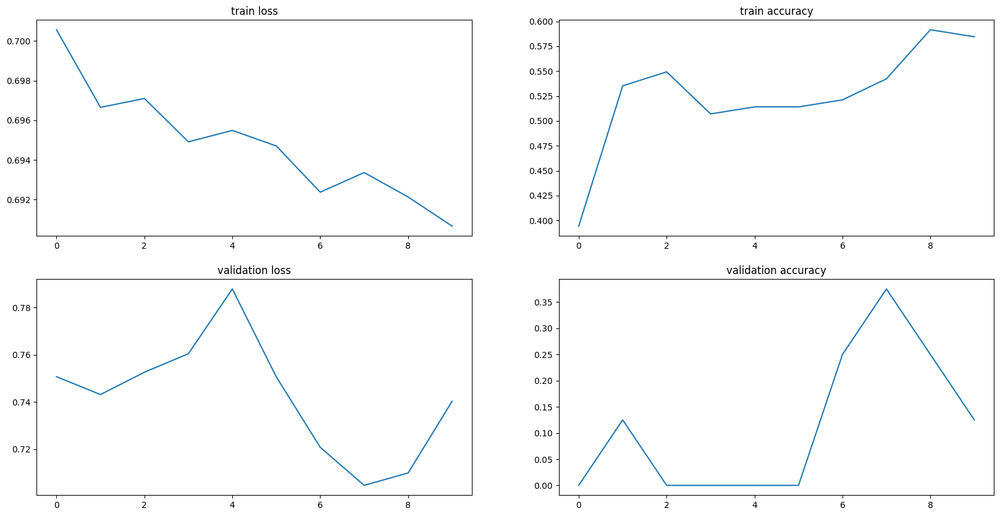

> This readme has been created using the [jupyter converter](https://github.com/jupyter/nbconvert/blob/main/README.md) .

**A cat or a dog?**

Dataset: https://www.kaggle.com/datasets/shaunthesheep/microsoft-catsvsdogs-dataset


**The objective of this project is to develop a model capable of distinguishing between images of cats and dogs.** 

The project is commissioned by the municipal authorities responsible for monitoring homeless animals on the streets. Several models have been developed for this purpose:

- An artificial neural network,

- A convolutional neural network with various modifications, including the application of SGD and Adam optimizers, adjustments to the number of epochs, incorporation of dropout layers and utilization of Data Augmentation techniques,

- Transfer learning using pre-trained models such as MobileNet V2, MobileNet V3 Large and VGG16.

The architecture of the convolutional neural network includes:

- Four convolutional layers, each containing 400 neurons and utilizing ReLU as the activation function (kernel size 3x3),

- One dense layer with 400 neurons and Sigmoid as the activation function,

- MaxPooling operations with a pool size of 2x2 and a stride of 2.

To monitor the progress of individual training sessions, the wandb tool has been employed. Furthermore, to assess whether increasing the number of epochs would lead to improvements in model parameters while avoiding overfitting, I have implemented the EarlyStopping callback, with accuracy and validation loss serving as monitoring parameters. These measures have been instrumental in guiding decisions.

Except for training, validation and testing accuracy, validation loss, precision, recall, and F1-score have been used as metrics for evaluating the models.

The experimentation process revealed that, currently, the most effective approach is to deploy the transfer learning model MobileNet V2. This model achieves a training accuracy of 99% and a testing accuracy of 94%. Nevertheless, there are still significant opportunities to explore other convolutional neural network architectures. These may involve adjustments to the network size, activation functions, and the number of neurons, among other parameters. These avenues hold promise for achieving satisfactory results and warrant further exploration.


```python
import os
from datetime import datetime

import numpy as np
import matplotlib.pyplot as plt
import cv2
from PIL import Image

from sklearn.preprocessing import OneHotEncoder, LabelEncoder
from sklearn.metrics import classification_report

import tensorflow as tf
from tensorflow import keras
from tensorflow.keras import layers
from tensorflow.keras.layers import Dropout
from tensorflow.keras.callbacks import EarlyStopping
from tensorflow.keras.preprocessing.image import ImageDataGenerator
from tensorflow.keras.utils import to_categorical
from tensorflow.keras import models

from wandb.keras import WandbMetricsLogger
```


```python

data_1200 = "/home/kata/zajecia/ćwiczenia_python_moje/projekt_DL/data_1200"

train_dir_1200 = os.path.join(data_1200, 'training')
test_dir_1200 = os.path.join(data_1200, 'testing')
add_test_dir_1200 = os.path.join(data_1200, 'additional_testing')
```

Checking the connection with wandb, which will be used later to monitor the progress of the trainings.


```python
!wandb login
```

    wandb: Currently logged in as: katarzynakarwacka. Use wandb login --relogin to force relogin


Defining a function that loads images from the given directory and preprocesses the data. Images are resized and normalized.


```python

def load_images(directory):
    images = []
    labels = []
    vectors = []
    label_encoder = LabelEncoder()
    for label in os.listdir(directory):
        label_dir = os.path.join(directory, label)
        for filename in os.listdir(label_dir):
            if filename.endswith('.jpg') or filename.endswith('.png'):  
                img = Image.open(os.path.join(label_dir, filename))
                img = img.resize((150, 150)) 
                img = np.array(img) / 255.0  
                vector = img.flatten()
                #print(vector)
                #print(len(vector))
                #print(os.path.join(label_dir, filename))
                if len(vector) == 67500:
                  #np.array(vectors)
                  vectors.append(vector)
                  images.append(img)
                  labels.append(label) 
                #x = vector
    labels = label_encoder.fit_transform(labels)
    labels = to_categorical(labels)
    return np.array(images), np.array(vectors), labels

```


```python
train_images_1200, train_vectors_1200, train_labels_1200 = load_images(train_dir_1200)
test_images_1200, test_vectors_1200, test_labels_1200 = load_images(test_dir_1200)

```

Defining a function that creates a CNN model


```python
def create_cnn_model(inShape, convNum, hNum, hAct, loss, optimizer):
    """
    :param inShape: input shape, h*w*c
    :param convNum: list of the number of features (kernels) in convolutional layers
    :param hNum: list of the number of neurons in each hidden layer
    :param hAct: activation function, str
    :param loss: loss function
    """
  
    model = tf.keras.Sequential()
    model.add(layers.InputLayer(input_shape=(inShape)))

    for _, oneConvNum in enumerate(convNum):

        model.add(layers.Conv2D(
                                    filters=oneConvNum,
                                    kernel_size=3,
                                    strides=1,
                                    padding="SAME",
                                    activation="relu"
                                    )
                                )
 
        model.add(layers.MaxPool2D(
                                    pool_size=(2, 2),
                                    strides=2,
                                    padding="SAME"
                                    )
                                )
 
    model.add(layers.Flatten())
   
    for _, oneHidNum in enumerate(hNum):
    
        model.add(layers.Dense(oneHidNum, activation=hAct))
 
    model.add(layers.Dense(1, activation='sigmoid'))

    print(model.summary())


    model.compile(
        optimizer=optimizer,
        loss=loss,
        metrics=["accuracy"]
    )

    return model
```

Calling popular optimizations algorithms:

-- SGD (Stochastic Gradient Descent) -- it works by updating the parameters (weights) of the model in the direction that reduces the loss function, making it a gradient-based  optimization

-- Adam (Adaptive Moment Estimation) -- adaptive learning rates, often faster than SGD


```python
opt_Adam = tf.keras.optimizers.Adam()
opt_SGD = tf.keras.optimizers.SGD()
```

As the images of cats and dogs are stored in separate folders, they are inherently ordered. To ensure a balanced distribution of cats and dogs images in the validation dataset, shuffling is necessary.


```python
np.random.seed(42)
np.random.shuffle(test_images_1200)
np.random.seed(42)
np.random.shuffle(test_labels_1200)

shuffled_test_images = np.copy(test_images_1200)
shuffled_test_labels = np.copy(test_labels_1200)
```

SGD model with 0.01 learning rate, 4 conv layers and one hidden layer


```python
CNN_1200_SGD = create_cnn_model(
    inShape= train_images_1200.shape[1:],
    convNum= [4,4,4,4],
    hNum = [400],
    hAct = 'relu',
    loss = keras.losses.BinaryCrossentropy(),
    optimizer = tf.keras.optimizers.legacy.SGD(learning_rate=0.01)

)
```

    Model: "sequential"
    _________________________________________________________________
     Layer (type)                Output Shape              Param #   
    =================================================================
     conv2d (Conv2D)             (None, 150, 150, 4)       112       
                                                                     
     max_pooling2d (MaxPooling2  (None, 75, 75, 4)         0         
     D)                                                              
                                                                     
     conv2d_1 (Conv2D)           (None, 75, 75, 4)         148       
                                                                     
     max_pooling2d_1 (MaxPoolin  (None, 38, 38, 4)         0         
     g2D)                                                            
                                                                     
     conv2d_2 (Conv2D)           (None, 38, 38, 4)         148       
                                                                     
     max_pooling2d_2 (MaxPoolin  (None, 19, 19, 4)         0         
     g2D)                                                            
                                                                     
     conv2d_3 (Conv2D)           (None, 19, 19, 4)         148       
                                                                     
     max_pooling2d_3 (MaxPoolin  (None, 10, 10, 4)         0         
     g2D)                                                            
                                                                     
     flatten (Flatten)           (None, 400)               0         
                                                                     
     dense (Dense)               (None, 400)               160400    
                                                                     
     dense_1 (Dense)             (None, 1)                 401       
                                                                     
    =================================================================
    Total params: 161357 (630.30 KB)
    Trainable params: 161357 (630.30 KB)
    Non-trainable params: 0 (0.00 Byte)
    _________________________________________________________________
    None


```python
import wandb
run = wandb.init(
    project="CNN_project_SGD",
    config={
        "dataset": "cats and dogs images",
    },
)

historyCNN1200SGD = CNN_1200_SGD.fit(
    x = train_images_1200,
    y = train_labels_1200[:,0],
    epochs = 10,
    validation_data = (shuffled_test_images[50:], shuffled_test_labels[50:,0]),
    callbacks = WandbMetricsLogger(),

)
```


Tracking run with wandb version 0.16.6


Run data is saved locally in <code>/home/kata/zajecia/ćwiczenia_python_moje/projekt_DL/wandb/run-20240412_134803-7tj37er4</code>


Syncing run <strong><a href='https://wandb.ai/xxxxxxxxxxxxxxxxxxxxxxx/CNN_project_SGD/runs/7tj37er4' target="_blank">smart-wind-4</a></strong> to <a href='https://wandb.ai/xxxxxxxxxxxxxxxxxxxxxxx/CNN_project_SGD' target="_blank">Weights & Biases</a> (<a href='https://wandb.me/run' target="_blank">docs</a>)<br/>


View project at <a href='https://wandb.ai/xxxxxxxxxxxxxxxxxxxxxxx/CNN_project_SGD' target="_blank">https://wandb.ai/xxxxxxxxxxxxxxxxxxxxxxx/CNN_project_SGD</a>


View run at <a href='https://wandb.ai/xxxxxxxxxxxxxxxxxxxxxxx/CNN_project_SGD/runs/7tj37er4' target="_blank">https://wandb.ai/xxxxxxxxxxxxxxxxxxxxxxx/CNN_project_SGD/runs/7tj37er4</a>


    Epoch 1/10
    32/32 [==============================] - 7s 182ms/step - loss: 0.6941 - accuracy: 0.5075 - val_loss: 0.6925 - val_accuracy: 0.5067
    Epoch 2/10
    32/32 [==============================] - 9s 284ms/step - loss: 0.6937 - accuracy: 0.5005 - val_loss: 0.6922 - val_accuracy: 0.5467
    Epoch 3/10
    32/32 [==============================] - 7s 210ms/step - loss: 0.6934 - accuracy: 0.5125 - val_loss: 0.6918 - val_accuracy: 0.5267
    Epoch 4/10
    32/32 [==============================] - 9s 283ms/step - loss: 0.6931 - accuracy: 0.5075 - val_loss: 0.6915 - val_accuracy: 0.5533
    Epoch 5/10
    32/32 [==============================] - 7s 213ms/step - loss: 0.6928 - accuracy: 0.5035 - val_loss: 0.6913 - val_accuracy: 0.5400
    Epoch 6/10
    32/32 [==============================] - 6s 190ms/step - loss: 0.6925 - accuracy: 0.5226 - val_loss: 0.6911 - val_accuracy: 0.5133
    Epoch 7/10
    32/32 [==============================] - 6s 180ms/step - loss: 0.6922 - accuracy: 0.5356 - val_loss: 0.6906 - val_accuracy: 0.5600
    Epoch 8/10
    32/32 [==============================] - 6s 188ms/step - loss: 0.6918 - accuracy: 0.5326 - val_loss: 0.6902 - val_accuracy: 0.5800
    Epoch 9/10
    32/32 [==============================] - 7s 209ms/step - loss: 0.6914 - accuracy: 0.5366 - val_loss: 0.6895 - val_accuracy: 0.5533
    Epoch 10/10
    32/32 [==============================] - 6s 191ms/step - loss: 0.6909 - accuracy: 0.5436 - val_loss: 0.6889 - val_accuracy: 0.5600


```python
fig, ax = plt.subplots(nrows=2,ncols=2, figsize=(20,10))

ax[0][0].plot(historyCNN1200SGD.history["loss"])
ax[0][1].plot(historyCNN1200SGD.history["accuracy"])
ax[1][0].plot(historyCNN1200SGD.history["val_loss"])
ax[1][1].plot(historyCNN1200SGD.history["val_accuracy"])

ax[0][0].set_title("train loss")
ax[0][1].set_title("train accuracy")
ax[1][0].set_title("validation loss")
ax[1][1].set_title("validation accuracy")
plt.show()
```


    

    


```python
y_predCNN_SGD_1200 = CNN_1200_SGD.predict(shuffled_test_images[:50])
binary_predictions = np.where(y_predCNN_SGD_1200 > 0.5, 1, 0)
report = classification_report(shuffled_test_labels[:50,0], binary_predictions)
print("Classification Report:")
print(report)

```

    2/2 [==============================] - 1s 142ms/step
    Classification Report:
                  precision    recall  f1-score   support
    
             0.0       0.43      0.87      0.58        23
             1.0       0.25      0.04      0.06        27
    
        accuracy                           0.42        50
       macro avg       0.34      0.45      0.32        50
    weighted avg       0.34      0.42      0.30        50
    


Creating a model with *Adam* as an optimizer


```python
CNN_1200_Adam = create_cnn_model(
    inShape= train_images_1200.shape[1:],
    convNum= [4,4,4,4],
    hNum = [400],
    hAct = 'relu',
    loss = keras.losses.BinaryCrossentropy(),
    optimizer = tf.keras.optimizers.legacy.Adam(learning_rate=0.001)

)
```

    Model: "sequential_1"
    _________________________________________________________________
     Layer (type)                Output Shape              Param #   
    =================================================================
     conv2d_4 (Conv2D)           (None, 150, 150, 4)       112       
                                                                     
     max_pooling2d_4 (MaxPoolin  (None, 75, 75, 4)         0         
     g2D)                                                            
                                                                     
     conv2d_5 (Conv2D)           (None, 75, 75, 4)         148       
                                                                     
     max_pooling2d_5 (MaxPoolin  (None, 38, 38, 4)         0         
     g2D)                                                            
                                                                     
     conv2d_6 (Conv2D)           (None, 38, 38, 4)         148       
                                                                     
     max_pooling2d_6 (MaxPoolin  (None, 19, 19, 4)         0         
     g2D)                                                            
                                                                     
     conv2d_7 (Conv2D)           (None, 19, 19, 4)         148       
                                                                     
     max_pooling2d_7 (MaxPoolin  (None, 10, 10, 4)         0         
     g2D)                                                            
                                                                     
     flatten_1 (Flatten)         (None, 400)               0         
                                                                     
     dense_2 (Dense)             (None, 400)               160400    
                                                                     
     dense_3 (Dense)             (None, 1)                 401       
                                                                     
    =================================================================
    Total params: 161357 (630.30 KB)
    Trainable params: 161357 (630.30 KB)
    Non-trainable params: 0 (0.00 Byte)
    _________________________________________________________________
    None


```python

import wandb
run = wandb.init(
    project="CNN_project_Adam",
    config={
        "dataset": "cats and dogs images",
    },
)

historyCNN1200Adam = CNN_1200_Adam.fit(
    x = train_images_1200,
    y = train_labels_1200[:,0],
    epochs = 10,
    validation_data = (shuffled_test_images[50:], shuffled_test_labels[50:,0]),
    callbacks = WandbMetricsLogger(),

)
```


Finishing last run (ID:7tj37er4) before initializing another...


<style>
    table.wandb td:nth-child(1) { padding: 0 10px; text-align: left ; width: auto;} td:nth-child(2) {text-align: left ; width: 100%}
    .wandb-row { display: flex; flex-direction: row; flex-wrap: wrap; justify-content: flex-start; width: 100% }
    .wandb-col { display: flex; flex-direction: column; flex-basis: 100%; flex: 1; padding: 10px; }
    </style>
<div class="wandb-row"><div class="wandb-col"><h3>Run history:</h3><br/><table class="wandb"><tr><td>epoch/accuracy</td><td>▂▁▃▂▁▅▇▆▇█</td></tr><tr><td>epoch/epoch</td><td>▁▂▃▃▄▅▆▆▇█</td></tr><tr><td>epoch/learning_rate</td><td>▁▁▁▁▁▁▁▁▁▁</td></tr><tr><td>epoch/loss</td><td>█▇▇▆▅▄▄▃▂▁</td></tr><tr><td>epoch/val_accuracy</td><td>▁▅▃▅▄▂▆█▅▆</td></tr><tr><td>epoch/val_loss</td><td>█▇▇▆▆▅▄▃▂▁</td></tr></table><br/></div><div class="wandb-col"><h3>Run summary:</h3><br/><table class="wandb"><tr><td>epoch/accuracy</td><td>0.54363</td></tr><tr><td>epoch/epoch</td><td>9</td></tr><tr><td>epoch/learning_rate</td><td>0.01</td></tr><tr><td>epoch/loss</td><td>0.69091</td></tr><tr><td>epoch/val_accuracy</td><td>0.56</td></tr><tr><td>epoch/val_loss</td><td>0.68893</td></tr></table><br/></div></div>


View run <strong style="color:#cdcd00">smart-wind-4</strong> at: <a href='https://wandb.ai/xxxxxxxxxxxxxxxxxxxxxxx/CNN_project_SGD/runs/7tj37er4' target="_blank">https://wandb.ai/xxxxxxxxxxxxxxxxxxxxxxx/CNN_project_SGD/runs/7tj37er4</a><br/> View project at: <a href='https://wandb.ai/xxxxxxxxxxxxxxxxxxxxxxx/CNN_project_SGD' target="_blank">https://wandb.ai/xxxxxxxxxxxxxxxxxxxxxxx/CNN_project_SGD</a><br/>Synced 6 W&B file(s), 0 media file(s), 0 artifact file(s) and 0 other file(s)


Find logs at: <code>./wandb/run-20240412_134803-7tj37er4/logs</code>


Successfully finished last run (ID:7tj37er4). Initializing new run:<br/>


Tracking run with wandb version 0.16.6


Run data is saved locally in <code>/home/kata/zajecia/ćwiczenia_python_moje/projekt_DL/wandb/run-20240412_134929-0cwdewyq</code>


Syncing run <strong><a href='https://wandb.ai/xxxxxxxxxxxxxxxxxxxxxxx/CNN_project_Adam/runs/0cwdewyq' target="_blank">gentle-water-2</a></strong> to <a href='https://wandb.ai/xxxxxxxxxxxxxxxxxxxxxxx/CNN_project_Adam' target="_blank">Weights & Biases</a> (<a href='https://wandb.me/run' target="_blank">docs</a>)<br/>


View project at <a href='https://wandb.ai/xxxxxxxxxxxxxxxxxxxxxxx/CNN_project_Adam' target="_blank">https://wandb.ai/xxxxxxxxxxxxxxxxxxxxxxx/CNN_project_Adam</a>


View run at <a href='https://wandb.ai/xxxxxxxxxxxxxxxxxxxxxxx/CNN_project_Adam/runs/0cwdewyq' target="_blank">https://wandb.ai/xxxxxxxxxxxxxxxxxxxxxxx/CNN_project_Adam/runs/0cwdewyq</a>


    Epoch 1/10
    32/32 [==============================] - 6s 180ms/step - loss: 0.6930 - accuracy: 0.4895 - val_loss: 0.6882 - val_accuracy: 0.5733
    Epoch 2/10
    32/32 [==============================] - 6s 169ms/step - loss: 0.6816 - accuracy: 0.5898 - val_loss: 0.6712 - val_accuracy: 0.5467
    Epoch 3/10
    32/32 [==============================] - 5s 163ms/step - loss: 0.6513 - accuracy: 0.6138 - val_loss: 0.6596 - val_accuracy: 0.5667
    Epoch 4/10
    32/32 [==============================] - 6s 183ms/step - loss: 0.6098 - accuracy: 0.6871 - val_loss: 0.6390 - val_accuracy: 0.6733
    Epoch 5/10
    32/32 [==============================] - 5s 168ms/step - loss: 0.5826 - accuracy: 0.7001 - val_loss: 0.6465 - val_accuracy: 0.6533
    Epoch 6/10
    32/32 [==============================] - 5s 161ms/step - loss: 0.5779 - accuracy: 0.6820 - val_loss: 0.6465 - val_accuracy: 0.6133
    Epoch 7/10
    32/32 [==============================] - 5s 169ms/step - loss: 0.5452 - accuracy: 0.7342 - val_loss: 0.6841 - val_accuracy: 0.5733
    Epoch 8/10
    32/32 [==============================] - 5s 171ms/step - loss: 0.5389 - accuracy: 0.7161 - val_loss: 0.6627 - val_accuracy: 0.6800
    Epoch 9/10
    32/32 [==============================] - 5s 164ms/step - loss: 0.4936 - accuracy: 0.7563 - val_loss: 0.6636 - val_accuracy: 0.6467
    Epoch 10/10
    32/32 [==============================] - 5s 166ms/step - loss: 0.4719 - accuracy: 0.7743 - val_loss: 0.6765 - val_accuracy: 0.6667


```python
y_predCNN_Adam_1200 = CNN_1200_Adam.predict(shuffled_test_images[:50])


binary_predictions = np.where(y_predCNN_Adam_1200 > 0.5, 1, 0)
report = classification_report(shuffled_test_labels[:50,0], binary_predictions)
print("Classification Report:")
print(report)

```

    2/2 [==============================] - 0s 37ms/step
    Classification Report:
                  precision    recall  f1-score   support
    
             0.0       0.48      0.61      0.54        23
             1.0       0.57      0.44      0.50        27
    
        accuracy                           0.52        50
       macro avg       0.53      0.53      0.52        50
    weighted avg       0.53      0.52      0.52        50
    


```python
fig, ax = plt.subplots(nrows=2,ncols=2, figsize=(20,10))

ax[0][0].plot(historyCNN1200Adam.history["loss"])
ax[0][1].plot(historyCNN1200Adam.history["accuracy"])
ax[1][0].plot(historyCNN1200Adam.history["val_loss"])
ax[1][1].plot(historyCNN1200Adam.history["val_accuracy"])

ax[0][0].set_title("train loss")
ax[0][1].set_title("train accuracy")
ax[1][0].set_title("validation loss")
ax[1][1].set_title("validation accuracy")
plt.show()
```


    

    


Training the model with an increased number of epochs (100) and Early Stopping callback applied (monintoring validation loss)


```python


early_stopping = EarlyStopping(
    monitor='val_loss', 
    patience=3,         
    verbose = 1,
    mode = "auto",
    #baseline = None,
    restore_best_weights=True 
 ) 
```


```python
import wandb
run = wandb.init(
    project="CNN_project_Adam_100epochs",
    config={
        "dataset": "cats and dogs images",
    },
)


```


Finishing last run (ID:0cwdewyq) before initializing another...


<style>
    table.wandb td:nth-child(1) { padding: 0 10px; text-align: left ; width: auto;} td:nth-child(2) {text-align: left ; width: 100%}
    .wandb-row { display: flex; flex-direction: row; flex-wrap: wrap; justify-content: flex-start; width: 100% }
    .wandb-col { display: flex; flex-direction: column; flex-basis: 100%; flex: 1; padding: 10px; }
    </style>
<div class="wandb-row"><div class="wandb-col"><h3>Run history:</h3><br/><table class="wandb"><tr><td>epoch/accuracy</td><td>▁▃▄▆▆▆▇▇██</td></tr><tr><td>epoch/epoch</td><td>▁▂▃▃▄▅▆▆▇█</td></tr><tr><td>epoch/learning_rate</td><td>▁▁▁▁▁▁▁▁▁▁</td></tr><tr><td>epoch/loss</td><td>██▇▅▅▄▃▃▂▁</td></tr><tr><td>epoch/val_accuracy</td><td>▂▁▂█▇▅▂█▆▇</td></tr><tr><td>epoch/val_loss</td><td>█▆▄▁▂▂▇▄▅▆</td></tr></table><br/></div><div class="wandb-col"><h3>Run summary:</h3><br/><table class="wandb"><tr><td>epoch/accuracy</td><td>0.77432</td></tr><tr><td>epoch/epoch</td><td>9</td></tr><tr><td>epoch/learning_rate</td><td>0.001</td></tr><tr><td>epoch/loss</td><td>0.4719</td></tr><tr><td>epoch/val_accuracy</td><td>0.66667</td></tr><tr><td>epoch/val_loss</td><td>0.67653</td></tr></table><br/></div></div>


View run <strong style="color:#cdcd00">gentle-water-2</strong> at: <a href='https://wandb.ai/xxxxxxxxxxxxxxxxxxxxxxx/CNN_project_Adam/runs/0cwdewyq' target="_blank">https://wandb.ai/xxxxxxxxxxxxxxxxxxxxxxx/CNN_project_Adam/runs/0cwdewyq</a><br/> View project at: <a href='https://wandb.ai/xxxxxxxxxxxxxxxxxxxxxxx/CNN_project_Adam' target="_blank">https://wandb.ai/xxxxxxxxxxxxxxxxxxxxxxx/CNN_project_Adam</a><br/>Synced 6 W&B file(s), 0 media file(s), 0 artifact file(s) and 0 other file(s)


Find logs at: <code>./wandb/run-20240412_134929-0cwdewyq/logs</code>


Successfully finished last run (ID:0cwdewyq). Initializing new run:<br/>


Tracking run with wandb version 0.16.6


Run data is saved locally in <code>/home/kata/zajecia/ćwiczenia_python_moje/projekt_DL/wandb/run-20240412_135112-3gd3sk4x</code>


Syncing run <strong><a href='https://wandb.ai/xxxxxxxxxxxxxxxxxxxxxxx/CNN_project_Adam_100epochs/runs/3gd3sk4x' target="_blank">vague-snowflake-2</a></strong> to <a href='https://wandb.ai/xxxxxxxxxxxxxxxxxxxxxxx/CNN_project_Adam_100epochs' target="_blank">Weights & Biases</a> (<a href='https://wandb.me/run' target="_blank">docs</a>)<br/>


View project at <a href='https://wandb.ai/xxxxxxxxxxxxxxxxxxxxxxx/CNN_project_Adam_100epochs' target="_blank">https://wandb.ai/xxxxxxxxxxxxxxxxxxxxxxx/CNN_project_Adam_100epochs</a>


View run at <a href='https://wandb.ai/xxxxxxxxxxxxxxxxxxxxxxx/CNN_project_Adam_100epochs/runs/3gd3sk4x' target="_blank">https://wandb.ai/xxxxxxxxxxxxxxxxxxxxxxx/CNN_project_Adam_100epochs/runs/3gd3sk4x</a>


```python

historyCNN1200Adam_100epochs = CNN_1200_Adam.fit(
    x = train_images_1200,
    y = train_labels_1200[:,0],
    epochs = 100,
    validation_data = (shuffled_test_images[50:], shuffled_test_labels[50:,0]),
    callbacks = [WandbMetricsLogger(),early_stopping]
                 

)
```

    Epoch 1/100
    32/32 [==============================] - 5s 151ms/step - loss: 0.4294 - accuracy: 0.8054 - val_loss: 0.7254 - val_accuracy: 0.6733
    Epoch 2/100
    32/32 [==============================] - 5s 145ms/step - loss: 0.4168 - accuracy: 0.8144 - val_loss: 0.7333 - val_accuracy: 0.6400
    Epoch 3/100
    32/32 [==============================] - 5s 144ms/step - loss: 0.3877 - accuracy: 0.8335 - val_loss: 0.7770 - val_accuracy: 0.6333
    Epoch 4/100
    31/32 [============================>.] - ETA: 0s - loss: 0.3728 - accuracy: 0.8317Restoring model weights from the end of the best epoch: 1.
    32/32 [==============================] - 5s 145ms/step - loss: 0.3723 - accuracy: 0.8315 - val_loss: 0.7874 - val_accuracy: 0.6267
    Epoch 4: early stopping


Early Stopping with *accuracy* parameter being monitored


```python

early_stopping_accuracy = EarlyStopping(
    monitor='accuracy',  
    patience=3,          
    verbose = 1,
    mode = "auto",
    restore_best_weights=True 
 )
```


```python
import wandb
run = wandb.init(
    project="CNN_project_Adam_100epochs_ES_acc",
    config={
        "dataset": "cats and dogs images",
    },
)

historyCNN1200Adam_100epochs = CNN_1200_Adam.fit(
    x = train_images_1200,
    y = train_labels_1200[:,0],
    epochs = 100,
    validation_data = (shuffled_test_images[50:], shuffled_test_labels[50:,0]),
    callbacks = [WandbMetricsLogger(),early_stopping_accuracy]
                 

)

```


Finishing last run (ID:3gd3sk4x) before initializing another...


<style>
    table.wandb td:nth-child(1) { padding: 0 10px; text-align: left ; width: auto;} td:nth-child(2) {text-align: left ; width: 100%}
    .wandb-row { display: flex; flex-direction: row; flex-wrap: wrap; justify-content: flex-start; width: 100% }
    .wandb-col { display: flex; flex-direction: column; flex-basis: 100%; flex: 1; padding: 10px; }
    </style>
<div class="wandb-row"><div class="wandb-col"><h3>Run history:</h3><br/><table class="wandb"><tr><td>epoch/accuracy</td><td>▁▃██</td></tr><tr><td>epoch/epoch</td><td>▁▃▆█</td></tr><tr><td>epoch/learning_rate</td><td>▁▁▁▁</td></tr><tr><td>epoch/loss</td><td>█▆▃▁</td></tr><tr><td>epoch/val_accuracy</td><td>█▃▂▁</td></tr><tr><td>epoch/val_loss</td><td>▁▂▇█</td></tr></table><br/></div><div class="wandb-col"><h3>Run summary:</h3><br/><table class="wandb"><tr><td>epoch/accuracy</td><td>0.83149</td></tr><tr><td>epoch/epoch</td><td>3</td></tr><tr><td>epoch/learning_rate</td><td>0.001</td></tr><tr><td>epoch/loss</td><td>0.37228</td></tr><tr><td>epoch/val_accuracy</td><td>0.62667</td></tr><tr><td>epoch/val_loss</td><td>0.78743</td></tr></table><br/></div></div>


View run <strong style="color:#cdcd00">vague-snowflake-2</strong> at: <a href='https://wandb.ai/xxxxxxxxxxxxxxxxxxxxxxx/CNN_project_Adam_100epochs/runs/3gd3sk4x' target="_blank">https://wandb.ai/xxxxxxxxxxxxxxxxxxxxxxx/CNN_project_Adam_100epochs/runs/3gd3sk4x</a><br/> View project at: <a href='https://wandb.ai/xxxxxxxxxxxxxxxxxxxxxxx/CNN_project_Adam_100epochs' target="_blank">https://wandb.ai/xxxxxxxxxxxxxxxxxxxxxxx/CNN_project_Adam_100epochs</a><br/>Synced 6 W&B file(s), 0 media file(s), 0 artifact file(s) and 0 other file(s)


Find logs at: <code>./wandb/run-20240412_135112-3gd3sk4x/logs</code>


Successfully finished last run (ID:3gd3sk4x). Initializing new run:<br/>


Tracking run with wandb version 0.16.6


Run data is saved locally in <code>/home/kata/zajecia/ćwiczenia_python_moje/projekt_DL/wandb/run-20240412_135148-fy2phktv</code>


Syncing run <strong><a href='https://wandb.ai/xxxxxxxxxxxxxxxxxxxxxxx/CNN_project_Adam_100epochs_ES_acc/runs/fy2phktv' target="_blank">dandy-spaceship-2</a></strong> to <a href='https://wandb.ai/xxxxxxxxxxxxxxxxxxxxxxx/CNN_project_Adam_100epochs_ES_acc' target="_blank">Weights & Biases</a> (<a href='https://wandb.me/run' target="_blank">docs</a>)<br/>


View project at <a href='https://wandb.ai/xxxxxxxxxxxxxxxxxxxxxxx/CNN_project_Adam_100epochs_ES_acc' target="_blank">https://wandb.ai/xxxxxxxxxxxxxxxxxxxxxxx/CNN_project_Adam_100epochs_ES_acc</a>


View run at <a href='https://wandb.ai/xxxxxxxxxxxxxxxxxxxxxxx/CNN_project_Adam_100epochs_ES_acc/runs/fy2phktv' target="_blank">https://wandb.ai/xxxxxxxxxxxxxxxxxxxxxxx/CNN_project_Adam_100epochs_ES_acc/runs/fy2phktv</a>


    Epoch 1/100
    32/32 [==============================] - 5s 151ms/step - loss: 0.4158 - accuracy: 0.8004 - val_loss: 0.7391 - val_accuracy: 0.6533
    Epoch 2/100
    32/32 [==============================] - 5s 145ms/step - loss: 0.3785 - accuracy: 0.8305 - val_loss: 0.7721 - val_accuracy: 0.6600
    Epoch 3/100
    32/32 [==============================] - 5s 143ms/step - loss: 0.3585 - accuracy: 0.8405 - val_loss: 0.7977 - val_accuracy: 0.6200
    Epoch 4/100
    32/32 [==============================] - 5s 143ms/step - loss: 0.3182 - accuracy: 0.8696 - val_loss: 0.8482 - val_accuracy: 0.6267
    Epoch 5/100
    32/32 [==============================] - 5s 143ms/step - loss: 0.3061 - accuracy: 0.8656 - val_loss: 0.9090 - val_accuracy: 0.6067
    Epoch 6/100
    32/32 [==============================] - 5s 144ms/step - loss: 0.2909 - accuracy: 0.8716 - val_loss: 0.8988 - val_accuracy: 0.6400
    Epoch 7/100
    32/32 [==============================] - 5s 147ms/step - loss: 0.2329 - accuracy: 0.9127 - val_loss: 0.9769 - val_accuracy: 0.6267
    Epoch 8/100
    32/32 [==============================] - 5s 142ms/step - loss: 0.2336 - accuracy: 0.9057 - val_loss: 0.9978 - val_accuracy: 0.6267
    Epoch 9/100
    32/32 [==============================] - 5s 143ms/step - loss: 0.1723 - accuracy: 0.9448 - val_loss: 1.1010 - val_accuracy: 0.6267
    Epoch 10/100
    32/32 [==============================] - 5s 163ms/step - loss: 0.1513 - accuracy: 0.9549 - val_loss: 1.1528 - val_accuracy: 0.6133
    Epoch 11/100
    32/32 [==============================] - 5s 156ms/step - loss: 0.1196 - accuracy: 0.9649 - val_loss: 1.3006 - val_accuracy: 0.6200
    Epoch 12/100
    32/32 [==============================] - 6s 181ms/step - loss: 0.0931 - accuracy: 0.9759 - val_loss: 1.3441 - val_accuracy: 0.6267
    Epoch 13/100
    32/32 [==============================] - 7s 204ms/step - loss: 0.0694 - accuracy: 0.9890 - val_loss: 1.4242 - val_accuracy: 0.6200
    Epoch 14/100
    32/32 [==============================] - 6s 182ms/step - loss: 0.0509 - accuracy: 0.9930 - val_loss: 1.5827 - val_accuracy: 0.6333
    Epoch 15/100
    32/32 [==============================] - 5s 166ms/step - loss: 0.0488 - accuracy: 0.9970 - val_loss: 1.5613 - val_accuracy: 0.6200
    Epoch 16/100
    32/32 [==============================] - 5s 162ms/step - loss: 0.0286 - accuracy: 1.0000 - val_loss: 1.6811 - val_accuracy: 0.6333
    Epoch 17/100
    32/32 [==============================] - 5s 158ms/step - loss: 0.0207 - accuracy: 0.9990 - val_loss: 1.7689 - val_accuracy: 0.6067
    Epoch 18/100
    32/32 [==============================] - 5s 164ms/step - loss: 0.0155 - accuracy: 1.0000 - val_loss: 1.8793 - val_accuracy: 0.6133
    Epoch 19/100
    31/32 [============================>.] - ETA: 0s - loss: 0.0118 - accuracy: 1.0000Restoring model weights from the end of the best epoch: 16.
    32/32 [==============================] - 5s 157ms/step - loss: 0.0120 - accuracy: 1.0000 - val_loss: 1.9437 - val_accuracy: 0.6267
    Epoch 19: early stopping


```python
fig, ax = plt.subplots(nrows=2,ncols=2, figsize=(20,10))

ax[0][0].plot(historyCNN1200Adam_100epochs.history["loss"])
ax[0][1].plot(historyCNN1200Adam_100epochs.history["accuracy"])
ax[1][0].plot(historyCNN1200Adam_100epochs.history["val_loss"])
ax[1][1].plot(historyCNN1200Adam_100epochs.history["val_accuracy"])

ax[0][0].set_title("train loss")
ax[0][1].set_title("train accuracy")
ax[1][0].set_title("validation loss")
ax[1][1].set_title("validation accuracy")
plt.show()
```


    

    


Creating a light and fast model


```python
import wandb
run = wandb.init(
    project="CNN_project_the_good_one",
    config={
        "dataset": "cats and dogs images",
    },
)

model_the_light_one = tf.keras.Sequential([
    layers.Conv2D(32, (3, 3), activation='relu', input_shape=(150, 150, 3)),
    layers.MaxPooling2D((2, 2)),
    layers.Conv2D(64, (3, 3), activation='relu'),
    layers.MaxPooling2D((2, 2)),
    layers.Conv2D(128, (3, 3), activation='relu'),
    layers.MaxPooling2D((2, 2)),
    layers.Conv2D(128, (3, 3), activation='relu'),
    layers.MaxPooling2D((2, 2)),
    layers.Flatten(),
    layers.Dense(512, activation='relu'),
    layers.Dense(1, activation='sigmoid')
])

```


Finishing last run (ID:fy2phktv) before initializing another...


<style>
    table.wandb td:nth-child(1) { padding: 0 10px; text-align: left ; width: auto;} td:nth-child(2) {text-align: left ; width: 100%}
    .wandb-row { display: flex; flex-direction: row; flex-wrap: wrap; justify-content: flex-start; width: 100% }
    .wandb-col { display: flex; flex-direction: column; flex-basis: 100%; flex: 1; padding: 10px; }
    </style>
<div class="wandb-row"><div class="wandb-col"><h3>Run history:</h3><br/><table class="wandb"><tr><td>epoch/accuracy</td><td>▁▂▂▃▃▃▅▅▆▆▇▇███████</td></tr><tr><td>epoch/epoch</td><td>▁▁▂▂▃▃▃▄▄▅▅▅▆▆▆▇▇██</td></tr><tr><td>epoch/learning_rate</td><td>▁▁▁▁▁▁▁▁▁▁▁▁▁▁▁▁▁▁▁</td></tr><tr><td>epoch/loss</td><td>█▇▇▆▆▆▅▅▄▃▃▂▂▂▂▁▁▁▁</td></tr><tr><td>epoch/val_accuracy</td><td>▇█▃▄▁▅▄▄▄▂▃▄▃▄▃▄▁▂▄</td></tr><tr><td>epoch/val_loss</td><td>▁▁▁▂▂▂▂▃▃▃▄▅▅▆▆▆▇██</td></tr></table><br/></div><div class="wandb-col"><h3>Run summary:</h3><br/><table class="wandb"><tr><td>epoch/accuracy</td><td>1.0</td></tr><tr><td>epoch/epoch</td><td>18</td></tr><tr><td>epoch/learning_rate</td><td>0.001</td></tr><tr><td>epoch/loss</td><td>0.01202</td></tr><tr><td>epoch/val_accuracy</td><td>0.62667</td></tr><tr><td>epoch/val_loss</td><td>1.94367</td></tr></table><br/></div></div>


View run <strong style="color:#cdcd00">dandy-spaceship-2</strong> at: <a href='https://wandb.ai/xxxxxxxxxxxxxxxxxxxxxxx/CNN_project_Adam_100epochs_ES_acc/runs/fy2phktv' target="_blank">https://wandb.ai/xxxxxxxxxxxxxxxxxxxxxxx/CNN_project_Adam_100epochs_ES_acc/runs/fy2phktv</a><br/> View project at: <a href='https://wandb.ai/xxxxxxxxxxxxxxxxxxxxxxx/CNN_project_Adam_100epochs_ES_acc' target="_blank">https://wandb.ai/xxxxxxxxxxxxxxxxxxxxxxx/CNN_project_Adam_100epochs_ES_acc</a><br/>Synced 6 W&B file(s), 0 media file(s), 0 artifact file(s) and 0 other file(s)


Find logs at: <code>./wandb/run-20240412_135148-fy2phktv/logs</code>


Successfully finished last run (ID:fy2phktv). Initializing new run:<br/>


Tracking run with wandb version 0.16.6


Run data is saved locally in <code>/home/kata/zajecia/ćwiczenia_python_moje/projekt_DL/wandb/run-20240412_135341-mbugm6yh</code>


Syncing run <strong><a href='https://wandb.ai/xxxxxxxxxxxxxxxxxxxxxxx/CNN_project_the_good_one/runs/mbugm6yh' target="_blank">silver-blaze-3</a></strong> to <a href='https://wandb.ai/xxxxxxxxxxxxxxxxxxxxxxx/CNN_project_the_good_one' target="_blank">Weights & Biases</a> (<a href='https://wandb.me/run' target="_blank">docs</a>)<br/>


View project at <a href='https://wandb.ai/xxxxxxxxxxxxxxxxxxxxxxx/CNN_project_the_good_one' target="_blank">https://wandb.ai/xxxxxxxxxxxxxxxxxxxxxxx/CNN_project_the_good_one</a>


View run at <a href='https://wandb.ai/xxxxxxxxxxxxxxxxxxxxxxx/CNN_project_the_good_one/runs/mbugm6yh' target="_blank">https://wandb.ai/xxxxxxxxxxxxxxxxxxxxxxx/CNN_project_the_good_one/runs/mbugm6yh</a>


```python
model_the_light_one.compile(optimizer='adam',
              loss='binary_crossentropy',
              metrics=['accuracy'], run_eagerly = True)


history_model_the_light_one = model_the_light_one.fit(
    x = train_images_1200,
    y = train_labels_1200[:,0],
    epochs = 10,
    validation_data = (shuffled_test_images[50:], shuffled_test_labels[50:,0]),
    callbacks = WandbMetricsLogger(),

)


```

    Epoch 1/10
    32/32 [==============================] - 39s 1s/step - loss: 0.7009 - accuracy: 0.5135 - val_loss: 0.6930 - val_accuracy: 0.4867
    Epoch 2/10
    32/32 [==============================] - 41s 1s/step - loss: 0.6917 - accuracy: 0.5246 - val_loss: 0.7082 - val_accuracy: 0.4867
    Epoch 3/10
    32/32 [==============================] - 51s 2s/step - loss: 0.6822 - accuracy: 0.5687 - val_loss: 0.6847 - val_accuracy: 0.5400
    Epoch 4/10
    32/32 [==============================] - 47s 1s/step - loss: 0.6809 - accuracy: 0.5888 - val_loss: 0.6898 - val_accuracy: 0.5200
    Epoch 5/10
    32/32 [==============================] - 49s 2s/step - loss: 0.6860 - accuracy: 0.5496 - val_loss: 0.6848 - val_accuracy: 0.5467
    Epoch 6/10
    32/32 [==============================] - 43s 1s/step - loss: 0.6725 - accuracy: 0.5486 - val_loss: 0.6832 - val_accuracy: 0.5133
    Epoch 7/10
    32/32 [==============================] - 45s 1s/step - loss: 0.6472 - accuracy: 0.6158 - val_loss: 0.7261 - val_accuracy: 0.5333
    Epoch 8/10
    32/32 [==============================] - 50s 2s/step - loss: 0.6466 - accuracy: 0.6158 - val_loss: 0.6933 - val_accuracy: 0.5267
    Epoch 9/10
    32/32 [==============================] - 40s 1s/step - loss: 0.5988 - accuracy: 0.6710 - val_loss: 0.7852 - val_accuracy: 0.5133
    Epoch 10/10
    32/32 [==============================] - 39s 1s/step - loss: 0.5923 - accuracy: 0.6750 - val_loss: 0.7782 - val_accuracy: 0.5533


```python
the_light_one_results = model_the_light_one.predict(shuffled_test_images[:50])
binary_predictions = np.where(the_light_one_results > 0.5, 1, 0)
report = classification_report(shuffled_test_labels[:50,0], binary_predictions)
print("Classification Report:")
print(report)
```

    2/2 [==============================] - 1s 169ms/step
    Classification Report:
                  precision    recall  f1-score   support
    
             0.0       0.50      0.65      0.57        23
             1.0       0.60      0.44      0.51        27
    
        accuracy                           0.54        50
       macro avg       0.55      0.55      0.54        50
    weighted avg       0.55      0.54      0.54        50
    


Adding *dropout* parameter to see whether it improves the results.


```python
def create_cnn_model_with_dropout(inShape, convNum, hNum, hAct, loss, optimizer, dropout_rate):

    model = tf.keras.Sequential()
    model.add(layers.InputLayer(input_shape=(inShape)))

    for idx, oneConvNum in enumerate(convNum):

        model.add(layers.Conv2D(
                                    filters=oneConvNum,
                                    kernel_size=3,
                                    strides=1,
                                    padding="SAME",
                                    activation="relu"
                                    )
                                )

        model.add(layers.MaxPool2D(
                                    pool_size=(2, 2),
                                    strides=2,
                                    padding="SAME"
                                    )
                                )

    model.add(layers.Flatten())

    for idx, oneHidNum in enumerate(hNum):
        model.add(layers.Dense(oneHidNum, activation=hAct))
        model.add(Dropout(rate=dropout_rate))

    model.add(layers.Dense(1, activation = 'sigmoid'))

    # model.add(layers.Softmax())
    print(model.summary())


    model.compile(
        optimizer=optimizer,
        loss=loss,
        metrics=["accuracy"]
    )

    return model
```

SGD model with *dropout* 0.1


```python

import wandb
run = wandb.init(
    project="CNN_project_SGD_dropout_0_1",
    config={
        "dataset": "cats and dogs images",
    },
)
modelCNN_SGD_dropout = create_cnn_model_with_dropout(
    inShape= train_images_1200.shape[1:],
    convNum=[4,4,4,4],
    hNum=[400],
    hAct="relu",
    loss=tf.keras.losses.BinaryCrossentropy(),
    optimizer= tf.keras.optimizers.SGD(),
    dropout_rate=0.1
)


historyCNN_SGD_dropout_0_1 = modelCNN_SGD_dropout.fit(
    x = train_images_1200,
    y = train_labels_1200[:,0],
    epochs = 10,
    validation_data = (shuffled_test_images[50:], shuffled_test_labels[50:,0]),
    callbacks = [WandbMetricsLogger(), early_stopping_accuracy],

)


```


Finishing last run (ID:mbugm6yh) before initializing another...


<style>
    table.wandb td:nth-child(1) { padding: 0 10px; text-align: left ; width: auto;} td:nth-child(2) {text-align: left ; width: 100%}
    .wandb-row { display: flex; flex-direction: row; flex-wrap: wrap; justify-content: flex-start; width: 100% }
    .wandb-col { display: flex; flex-direction: column; flex-basis: 100%; flex: 1; padding: 10px; }
    </style>
<div class="wandb-row"><div class="wandb-col"><h3>Run history:</h3><br/><table class="wandb"><tr><td>epoch/accuracy</td><td>▁▁▃▄▃▃▅▅██</td></tr><tr><td>epoch/epoch</td><td>▁▂▃▃▄▅▆▆▇█</td></tr><tr><td>epoch/learning_rate</td><td>▁▁▁▁▁▁▁▁▁▁</td></tr><tr><td>epoch/loss</td><td>█▇▇▇▇▆▅▄▁▁</td></tr><tr><td>epoch/val_accuracy</td><td>▁▁▇▄▇▄▆▅▄█</td></tr><tr><td>epoch/val_loss</td><td>▂▃▁▁▁▁▄▂██</td></tr></table><br/></div><div class="wandb-col"><h3>Run summary:</h3><br/><table class="wandb"><tr><td>epoch/accuracy</td><td>0.67503</td></tr><tr><td>epoch/epoch</td><td>9</td></tr><tr><td>epoch/learning_rate</td><td>0.001</td></tr><tr><td>epoch/loss</td><td>0.59227</td></tr><tr><td>epoch/val_accuracy</td><td>0.55333</td></tr><tr><td>epoch/val_loss</td><td>0.77825</td></tr></table><br/></div></div>


View run <strong style="color:#cdcd00">silver-blaze-3</strong> at: <a href='https://wandb.ai/xxxxxxxxxxxxxxxxxxxxxxx/CNN_project_the_good_one/runs/mbugm6yh' target="_blank">https://wandb.ai/xxxxxxxxxxxxxxxxxxxxxxx/CNN_project_the_good_one/runs/mbugm6yh</a><br/> View project at: <a href='https://wandb.ai/xxxxxxxxxxxxxxxxxxxxxxx/CNN_project_the_good_one' target="_blank">https://wandb.ai/xxxxxxxxxxxxxxxxxxxxxxx/CNN_project_the_good_one</a><br/>Synced 6 W&B file(s), 0 media file(s), 0 artifact file(s) and 0 other file(s)


Find logs at: <code>./wandb/run-20240412_135341-mbugm6yh/logs</code>


Successfully finished last run (ID:mbugm6yh). Initializing new run:<br/>


Tracking run with wandb version 0.16.6


Run data is saved locally in <code>/home/kata/zajecia/ćwiczenia_python_moje/projekt_DL/wandb/run-20240412_140122-yeggbmqy</code>


Syncing run <strong><a href='https://wandb.ai/xxxxxxxxxxxxxxxxxxxxxxx/CNN_project_SGD_dropout_0_1/runs/yeggbmqy' target="_blank">fallen-waterfall-4</a></strong> to <a href='https://wandb.ai/xxxxxxxxxxxxxxxxxxxxxxx/CNN_project_SGD_dropout_0_1' target="_blank">Weights & Biases</a> (<a href='https://wandb.me/run' target="_blank">docs</a>)<br/>


View project at <a href='https://wandb.ai/xxxxxxxxxxxxxxxxxxxxxxx/CNN_project_SGD_dropout_0_1' target="_blank">https://wandb.ai/xxxxxxxxxxxxxxxxxxxxxxx/CNN_project_SGD_dropout_0_1</a>


View run at <a href='https://wandb.ai/xxxxxxxxxxxxxxxxxxxxxxx/CNN_project_SGD_dropout_0_1/runs/yeggbmqy' target="_blank">https://wandb.ai/xxxxxxxxxxxxxxxxxxxxxxx/CNN_project_SGD_dropout_0_1/runs/yeggbmqy</a>


    Model: "sequential_3"
    _________________________________________________________________
     Layer (type)                Output Shape              Param #   
    =================================================================
     conv2d_12 (Conv2D)          (None, 150, 150, 4)       112       
                                                                     
     max_pooling2d_12 (MaxPooli  (None, 75, 75, 4)         0         
     ng2D)                                                           
                                                                     
     conv2d_13 (Conv2D)          (None, 75, 75, 4)         148       
                                                                     
     max_pooling2d_13 (MaxPooli  (None, 38, 38, 4)         0         
     ng2D)                                                           
                                                                     
     conv2d_14 (Conv2D)          (None, 38, 38, 4)         148       
                                                                     
     max_pooling2d_14 (MaxPooli  (None, 19, 19, 4)         0         
     ng2D)                                                           
                                                                     
     conv2d_15 (Conv2D)          (None, 19, 19, 4)         148       
                                                                     
     max_pooling2d_15 (MaxPooli  (None, 10, 10, 4)         0         
     ng2D)                                                           
                                                                     
     flatten_3 (Flatten)         (None, 400)               0         
                                                                     
     dense_6 (Dense)             (None, 400)               160400    
                                                                     
     dropout (Dropout)           (None, 400)               0         
                                                                     
     dense_7 (Dense)             (None, 1)                 401       
                                                                     
    =================================================================
    Total params: 161357 (630.30 KB)
    Trainable params: 161357 (630.30 KB)
    Non-trainable params: 0 (0.00 Byte)
    _________________________________________________________________
    None
    Epoch 1/10
    32/32 [==============================] - 6s 164ms/step - loss: 0.6985 - accuracy: 0.4905 - val_loss: 0.6909 - val_accuracy: 0.5333
    Epoch 2/10
    32/32 [==============================] - 5s 153ms/step - loss: 0.6935 - accuracy: 0.5015 - val_loss: 0.6914 - val_accuracy: 0.5067
    Epoch 3/10
    32/32 [==============================] - 5s 153ms/step - loss: 0.6915 - accuracy: 0.5336 - val_loss: 0.6905 - val_accuracy: 0.5400
    Epoch 4/10
    32/32 [==============================] - 5s 151ms/step - loss: 0.6925 - accuracy: 0.5256 - val_loss: 0.6901 - val_accuracy: 0.5333
    Epoch 5/10
    32/32 [==============================] - 5s 152ms/step - loss: 0.6914 - accuracy: 0.5386 - val_loss: 0.6897 - val_accuracy: 0.5533
    Epoch 6/10
    32/32 [==============================] - 5s 157ms/step - loss: 0.6896 - accuracy: 0.5396 - val_loss: 0.6892 - val_accuracy: 0.5267
    Epoch 7/10
    32/32 [==============================] - 5s 149ms/step - loss: 0.6875 - accuracy: 0.5827 - val_loss: 0.6881 - val_accuracy: 0.5667
    Epoch 8/10
    32/32 [==============================] - 5s 153ms/step - loss: 0.6871 - accuracy: 0.5657 - val_loss: 0.6873 - val_accuracy: 0.5600
    Epoch 9/10
    32/32 [==============================] - 6s 176ms/step - loss: 0.6860 - accuracy: 0.5737 - val_loss: 0.6867 - val_accuracy: 0.5733
    Epoch 10/10
    32/32 [==============================] - 5s 159ms/step - loss: 0.6858 - accuracy: 0.5868 - val_loss: 0.6855 - val_accuracy: 0.5867


SGD model with *dropout* 0.3


```python
import wandb
run = wandb.init(
    project="CNN_project_SGD_dropout_0_3",
    config={
        "dataset": "cats and dogs images",
    },
)
modelCNN_SGD_dropout = create_cnn_model_with_dropout(
    inShape= train_images_1200.shape[1:],
    convNum=[4,4,4,4],
    hNum=[400],
    hAct="relu",
    loss=tf.keras.losses.BinaryCrossentropy(),
    optimizer= tf.keras.optimizers.SGD(),
    dropout_rate=0.3
)


historyCNN_SGD_dropout_0_1 = modelCNN_SGD_dropout.fit(
    x = train_images_1200,
    y = train_labels_1200[:,0],
    epochs = 10,
    validation_data = (shuffled_test_images[50:], shuffled_test_labels[50:,0]),
    callbacks = [WandbMetricsLogger(), early_stopping_accuracy],

)
```


Finishing last run (ID:yeggbmqy) before initializing another...


<style>
    table.wandb td:nth-child(1) { padding: 0 10px; text-align: left ; width: auto;} td:nth-child(2) {text-align: left ; width: 100%}
    .wandb-row { display: flex; flex-direction: row; flex-wrap: wrap; justify-content: flex-start; width: 100% }
    .wandb-col { display: flex; flex-direction: column; flex-basis: 100%; flex: 1; padding: 10px; }
    </style>
<div class="wandb-row"><div class="wandb-col"><h3>Run history:</h3><br/><table class="wandb"><tr><td>epoch/accuracy</td><td>▁▂▄▄▄▅█▆▇█</td></tr><tr><td>epoch/epoch</td><td>▁▂▃▃▄▅▆▆▇█</td></tr><tr><td>epoch/learning_rate</td><td>▁▁▁▁▁▁▁▁▁▁</td></tr><tr><td>epoch/loss</td><td>█▅▄▅▄▃▂▂▁▁</td></tr><tr><td>epoch/val_accuracy</td><td>▃▁▄▃▅▃▆▆▇█</td></tr><tr><td>epoch/val_loss</td><td>▇█▇▆▆▅▄▃▂▁</td></tr></table><br/></div><div class="wandb-col"><h3>Run summary:</h3><br/><table class="wandb"><tr><td>epoch/accuracy</td><td>0.58676</td></tr><tr><td>epoch/epoch</td><td>9</td></tr><tr><td>epoch/learning_rate</td><td>0.01</td></tr><tr><td>epoch/loss</td><td>0.68581</td></tr><tr><td>epoch/val_accuracy</td><td>0.58667</td></tr><tr><td>epoch/val_loss</td><td>0.68554</td></tr></table><br/></div></div>


View run <strong style="color:#cdcd00">fallen-waterfall-4</strong> at: <a href='https://wandb.ai/xxxxxxxxxxxxxxxxxxxxxxx/CNN_project_SGD_dropout_0_1/runs/yeggbmqy' target="_blank">https://wandb.ai/xxxxxxxxxxxxxxxxxxxxxxx/CNN_project_SGD_dropout_0_1/runs/yeggbmqy</a><br/> View project at: <a href='https://wandb.ai/xxxxxxxxxxxxxxxxxxxxxxx/CNN_project_SGD_dropout_0_1' target="_blank">https://wandb.ai/xxxxxxxxxxxxxxxxxxxxxxx/CNN_project_SGD_dropout_0_1</a><br/>Synced 6 W&B file(s), 0 media file(s), 0 artifact file(s) and 0 other file(s)


Find logs at: <code>./wandb/run-20240412_140122-yeggbmqy/logs</code>


Successfully finished last run (ID:yeggbmqy). Initializing new run:<br/>


Tracking run with wandb version 0.16.6


Run data is saved locally in <code>/home/kata/zajecia/ćwiczenia_python_moje/projekt_DL/wandb/run-20240412_140231-uva09h96</code>


Syncing run <strong><a href='https://wandb.ai/xxxxxxxxxxxxxxxxxxxxxxx/CNN_project_SGD_dropout_0_3/runs/uva09h96' target="_blank">polar-paper-3</a></strong> to <a href='https://wandb.ai/xxxxxxxxxxxxxxxxxxxxxxx/CNN_project_SGD_dropout_0_3' target="_blank">Weights & Biases</a> (<a href='https://wandb.me/run' target="_blank">docs</a>)<br/>


View project at <a href='https://wandb.ai/xxxxxxxxxxxxxxxxxxxxxxx/CNN_project_SGD_dropout_0_3' target="_blank">https://wandb.ai/xxxxxxxxxxxxxxxxxxxxxxx/CNN_project_SGD_dropout_0_3</a>


View run at <a href='https://wandb.ai/xxxxxxxxxxxxxxxxxxxxxxx/CNN_project_SGD_dropout_0_3/runs/uva09h96' target="_blank">https://wandb.ai/xxxxxxxxxxxxxxxxxxxxxxx/CNN_project_SGD_dropout_0_3/runs/uva09h96</a>


    Model: "sequential_4"
    _________________________________________________________________
     Layer (type)                Output Shape              Param #   
    =================================================================
     conv2d_16 (Conv2D)          (None, 150, 150, 4)       112       
                                                                     
     max_pooling2d_16 (MaxPooli  (None, 75, 75, 4)         0         
     ng2D)                                                           
                                                                     
     conv2d_17 (Conv2D)          (None, 75, 75, 4)         148       
                                                                     
     max_pooling2d_17 (MaxPooli  (None, 38, 38, 4)         0         
     ng2D)                                                           
                                                                     
     conv2d_18 (Conv2D)          (None, 38, 38, 4)         148       
                                                                     
     max_pooling2d_18 (MaxPooli  (None, 19, 19, 4)         0         
     ng2D)                                                           
                                                                     
     conv2d_19 (Conv2D)          (None, 19, 19, 4)         148       
                                                                     
     max_pooling2d_19 (MaxPooli  (None, 10, 10, 4)         0         
     ng2D)                                                           
                                                                     
     flatten_4 (Flatten)         (None, 400)               0         
                                                                     
     dense_8 (Dense)             (None, 400)               160400    
                                                                     
     dropout_1 (Dropout)         (None, 400)               0         
                                                                     
     dense_9 (Dense)             (None, 1)                 401       
                                                                     
    =================================================================
    Total params: 161357 (630.30 KB)
    Trainable params: 161357 (630.30 KB)
    Non-trainable params: 0 (0.00 Byte)
    _________________________________________________________________
    None
    Epoch 1/10
    32/32 [==============================] - 7s 188ms/step - loss: 0.6935 - accuracy: 0.5035 - val_loss: 0.6932 - val_accuracy: 0.5133
    Epoch 2/10
    32/32 [==============================] - 5s 152ms/step - loss: 0.6928 - accuracy: 0.5075 - val_loss: 0.6931 - val_accuracy: 0.5200
    Epoch 3/10
    32/32 [==============================] - 5s 150ms/step - loss: 0.6931 - accuracy: 0.5015 - val_loss: 0.6931 - val_accuracy: 0.5133
    Epoch 4/10
    32/32 [==============================] - 5s 152ms/step - loss: 0.6928 - accuracy: 0.4975 - val_loss: 0.6930 - val_accuracy: 0.5067
    Epoch 5/10
    32/32 [==============================] - 5s 150ms/step - loss: 0.6924 - accuracy: 0.5155 - val_loss: 0.6929 - val_accuracy: 0.5200
    Epoch 6/10
    32/32 [==============================] - 5s 151ms/step - loss: 0.6929 - accuracy: 0.4995 - val_loss: 0.6930 - val_accuracy: 0.4933
    Epoch 7/10
    32/32 [==============================] - 5s 152ms/step - loss: 0.6929 - accuracy: 0.4995 - val_loss: 0.6930 - val_accuracy: 0.5000
    Epoch 8/10
    32/32 [==============================] - 5s 151ms/step - loss: 0.6923 - accuracy: 0.5286 - val_loss: 0.6929 - val_accuracy: 0.5133
    Epoch 9/10
    32/32 [==============================] - 5s 151ms/step - loss: 0.6926 - accuracy: 0.5015 - val_loss: 0.6928 - val_accuracy: 0.5267
    Epoch 10/10
    32/32 [==============================] - 6s 179ms/step - loss: 0.6929 - accuracy: 0.5176 - val_loss: 0.6929 - val_accuracy: 0.5467


Adam model with *dropout* 0.1


```python

import wandb
run = wandb.init(
    project="CNN_project_Adam_dropout_0_1",
    config={
        "dataset": "cats and dogs images",
    },
)
modelCNN_Adam_dropout = create_cnn_model_with_dropout(
    inShape= train_images_1200.shape[1:],
    convNum=[4,4,4,4],
    hNum=[400],
    hAct="relu",
    loss=tf.keras.losses.BinaryCrossentropy(),
    optimizer= tf.keras.optimizers.Adam(),
    dropout_rate=0.1
)


historyCNN_Adam_dropout_0_1 = modelCNN_Adam_dropout.fit(
    x = train_images_1200,
    y = train_labels_1200[:,0],
    epochs = 10,
    validation_data = (shuffled_test_images[50:], shuffled_test_labels[50:,0]),
    callbacks = [WandbMetricsLogger(), early_stopping_accuracy],

)
```


Finishing last run (ID:uva09h96) before initializing another...


<style>
    table.wandb td:nth-child(1) { padding: 0 10px; text-align: left ; width: auto;} td:nth-child(2) {text-align: left ; width: 100%}
    .wandb-row { display: flex; flex-direction: row; flex-wrap: wrap; justify-content: flex-start; width: 100% }
    .wandb-col { display: flex; flex-direction: column; flex-basis: 100%; flex: 1; padding: 10px; }
    </style>
<div class="wandb-row"><div class="wandb-col"><h3>Run history:</h3><br/><table class="wandb"><tr><td>epoch/accuracy</td><td>▂▃▂▁▅▁▁█▂▆</td></tr><tr><td>epoch/epoch</td><td>▁▂▃▃▄▅▆▆▇█</td></tr><tr><td>epoch/learning_rate</td><td>▁▁▁▁▁▁▁▁▁▁</td></tr><tr><td>epoch/loss</td><td>█▄▆▄▂▄▄▁▃▄</td></tr><tr><td>epoch/val_accuracy</td><td>▄▄▄▃▄▁▂▄▅█</td></tr><tr><td>epoch/val_loss</td><td>█▆▆▄▂▄▅▂▁▂</td></tr></table><br/></div><div class="wandb-col"><h3>Run summary:</h3><br/><table class="wandb"><tr><td>epoch/accuracy</td><td>0.51755</td></tr><tr><td>epoch/epoch</td><td>9</td></tr><tr><td>epoch/learning_rate</td><td>0.01</td></tr><tr><td>epoch/loss</td><td>0.69288</td></tr><tr><td>epoch/val_accuracy</td><td>0.54667</td></tr><tr><td>epoch/val_loss</td><td>0.6929</td></tr></table><br/></div></div>


View run <strong style="color:#cdcd00">polar-paper-3</strong> at: <a href='https://wandb.ai/xxxxxxxxxxxxxxxxxxxxxxx/CNN_project_SGD_dropout_0_3/runs/uva09h96' target="_blank">https://wandb.ai/xxxxxxxxxxxxxxxxxxxxxxx/CNN_project_SGD_dropout_0_3/runs/uva09h96</a><br/> View project at: <a href='https://wandb.ai/xxxxxxxxxxxxxxxxxxxxxxx/CNN_project_SGD_dropout_0_3' target="_blank">https://wandb.ai/xxxxxxxxxxxxxxxxxxxxxxx/CNN_project_SGD_dropout_0_3</a><br/>Synced 6 W&B file(s), 0 media file(s), 0 artifact file(s) and 0 other file(s)


Find logs at: <code>./wandb/run-20240412_140231-uva09h96/logs</code>


Successfully finished last run (ID:uva09h96). Initializing new run:<br/>


Tracking run with wandb version 0.16.6


Run data is saved locally in <code>/home/kata/zajecia/ćwiczenia_python_moje/projekt_DL/wandb/run-20240412_140340-lw2yuqot</code>


Syncing run <strong><a href='https://wandb.ai/xxxxxxxxxxxxxxxxxxxxxxx/CNN_project_Adam_dropout_0_1/runs/lw2yuqot' target="_blank">devout-monkey-2</a></strong> to <a href='https://wandb.ai/xxxxxxxxxxxxxxxxxxxxxxx/CNN_project_Adam_dropout_0_1' target="_blank">Weights & Biases</a> (<a href='https://wandb.me/run' target="_blank">docs</a>)<br/>


View project at <a href='https://wandb.ai/xxxxxxxxxxxxxxxxxxxxxxx/CNN_project_Adam_dropout_0_1' target="_blank">https://wandb.ai/xxxxxxxxxxxxxxxxxxxxxxx/CNN_project_Adam_dropout_0_1</a>


View run at <a href='https://wandb.ai/xxxxxxxxxxxxxxxxxxxxxxx/CNN_project_Adam_dropout_0_1/runs/lw2yuqot' target="_blank">https://wandb.ai/xxxxxxxxxxxxxxxxxxxxxxx/CNN_project_Adam_dropout_0_1/runs/lw2yuqot</a>


    Model: "sequential_5"
    _________________________________________________________________
     Layer (type)                Output Shape              Param #   
    =================================================================
     conv2d_20 (Conv2D)          (None, 150, 150, 4)       112       
                                                                     
     max_pooling2d_20 (MaxPooli  (None, 75, 75, 4)         0         
     ng2D)                                                           
                                                                     
     conv2d_21 (Conv2D)          (None, 75, 75, 4)         148       
                                                                     
     max_pooling2d_21 (MaxPooli  (None, 38, 38, 4)         0         
     ng2D)                                                           
                                                                     
     conv2d_22 (Conv2D)          (None, 38, 38, 4)         148       
                                                                     
     max_pooling2d_22 (MaxPooli  (None, 19, 19, 4)         0         
     ng2D)                                                           
                                                                     
     conv2d_23 (Conv2D)          (None, 19, 19, 4)         148       
                                                                     
     max_pooling2d_23 (MaxPooli  (None, 10, 10, 4)         0         
     ng2D)                                                           
                                                                     
     flatten_5 (Flatten)         (None, 400)               0         
                                                                     
     dense_10 (Dense)            (None, 400)               160400    
                                                                     
     dropout_2 (Dropout)         (None, 400)               0         
                                                                     
     dense_11 (Dense)            (None, 1)                 401       
                                                                     
    =================================================================
    Total params: 161357 (630.30 KB)
    Trainable params: 161357 (630.30 KB)
    Non-trainable params: 0 (0.00 Byte)
    _________________________________________________________________
    None
    Epoch 1/10
    32/32 [==============================] - 7s 172ms/step - loss: 0.6938 - accuracy: 0.5085 - val_loss: 0.6822 - val_accuracy: 0.5600
    Epoch 2/10
    32/32 [==============================] - 5s 154ms/step - loss: 0.6642 - accuracy: 0.6259 - val_loss: 0.6639 - val_accuracy: 0.5467
    Epoch 3/10
    32/32 [==============================] - 5s 152ms/step - loss: 0.6362 - accuracy: 0.6379 - val_loss: 0.6872 - val_accuracy: 0.6000
    Epoch 4/10
    32/32 [==============================] - 5s 153ms/step - loss: 0.6048 - accuracy: 0.6670 - val_loss: 0.7285 - val_accuracy: 0.6267
    Epoch 5/10
    32/32 [==============================] - 5s 153ms/step - loss: 0.6106 - accuracy: 0.6479 - val_loss: 0.6734 - val_accuracy: 0.6067
    Epoch 6/10
    32/32 [==============================] - 5s 153ms/step - loss: 0.5651 - accuracy: 0.7081 - val_loss: 0.7160 - val_accuracy: 0.6000
    Epoch 7/10
    32/32 [==============================] - 5s 155ms/step - loss: 0.5459 - accuracy: 0.7182 - val_loss: 0.7122 - val_accuracy: 0.6333
    Epoch 8/10
    32/32 [==============================] - 5s 156ms/step - loss: 0.5315 - accuracy: 0.7242 - val_loss: 0.7142 - val_accuracy: 0.6400
    Epoch 9/10
    32/32 [==============================] - 5s 153ms/step - loss: 0.5026 - accuracy: 0.7523 - val_loss: 0.7078 - val_accuracy: 0.6467
    Epoch 10/10
    32/32 [==============================] - 6s 178ms/step - loss: 0.4624 - accuracy: 0.7914 - val_loss: 0.7615 - val_accuracy: 0.6267


Adam model with *dropout* 0.3


```python
import wandb
run = wandb.init(
    project="CNN_project_Adam_dropout_0_3",
    config={
        "dataset": "cats and dogs images",
    },
)
modelCNN_SGD_dropout = create_cnn_model_with_dropout(
    inShape= train_images_1200.shape[1:],
    convNum=[4,4,4,4],
    hNum=[400],
    hAct="relu",
    loss=tf.keras.losses.BinaryCrossentropy(),
    optimizer= tf.keras.optimizers.Adam(),
    dropout_rate=0.3
)


historyCNN_SGD_dropout_0_1 = modelCNN_SGD_dropout.fit(
    x = train_images_1200,
    y = train_labels_1200[:,0],
    epochs = 10,
    validation_data = (shuffled_test_images[50:], shuffled_test_labels[50:,0]),
    callbacks = [WandbMetricsLogger(), early_stopping_accuracy],

)

```


Finishing last run (ID:lw2yuqot) before initializing another...


<style>
    table.wandb td:nth-child(1) { padding: 0 10px; text-align: left ; width: auto;} td:nth-child(2) {text-align: left ; width: 100%}
    .wandb-row { display: flex; flex-direction: row; flex-wrap: wrap; justify-content: flex-start; width: 100% }
    .wandb-col { display: flex; flex-direction: column; flex-basis: 100%; flex: 1; padding: 10px; }
    </style>
<div class="wandb-row"><div class="wandb-col"><h3>Run history:</h3><br/><table class="wandb"><tr><td>epoch/accuracy</td><td>▁▄▄▅▄▆▆▆▇█</td></tr><tr><td>epoch/epoch</td><td>▁▂▃▃▄▅▆▆▇█</td></tr><tr><td>epoch/learning_rate</td><td>▁▁▁▁▁▁▁▁▁▁</td></tr><tr><td>epoch/loss</td><td>█▇▆▅▅▄▄▃▂▁</td></tr><tr><td>epoch/val_accuracy</td><td>▂▁▅▇▅▅▇██▇</td></tr><tr><td>epoch/val_loss</td><td>▂▁▃▆▂▅▄▅▄█</td></tr></table><br/></div><div class="wandb-col"><h3>Run summary:</h3><br/><table class="wandb"><tr><td>epoch/accuracy</td><td>0.79137</td></tr><tr><td>epoch/epoch</td><td>9</td></tr><tr><td>epoch/learning_rate</td><td>0.001</td></tr><tr><td>epoch/loss</td><td>0.46239</td></tr><tr><td>epoch/val_accuracy</td><td>0.62667</td></tr><tr><td>epoch/val_loss</td><td>0.7615</td></tr></table><br/></div></div>


View run <strong style="color:#cdcd00">devout-monkey-2</strong> at: <a href='https://wandb.ai/xxxxxxxxxxxxxxxxxxxxxxx/CNN_project_Adam_dropout_0_1/runs/lw2yuqot' target="_blank">https://wandb.ai/xxxxxxxxxxxxxxxxxxxxxxx/CNN_project_Adam_dropout_0_1/runs/lw2yuqot</a><br/> View project at: <a href='https://wandb.ai/xxxxxxxxxxxxxxxxxxxxxxx/CNN_project_Adam_dropout_0_1' target="_blank">https://wandb.ai/xxxxxxxxxxxxxxxxxxxxxxx/CNN_project_Adam_dropout_0_1</a><br/>Synced 6 W&B file(s), 0 media file(s), 0 artifact file(s) and 0 other file(s)


Find logs at: <code>./wandb/run-20240412_140340-lw2yuqot/logs</code>


Successfully finished last run (ID:lw2yuqot). Initializing new run:<br/>


Tracking run with wandb version 0.16.6


Run data is saved locally in <code>/home/kata/zajecia/ćwiczenia_python_moje/projekt_DL/wandb/run-20240412_140451-32dcl3vz</code>


Syncing run <strong><a href='https://wandb.ai/xxxxxxxxxxxxxxxxxxxxxxx/CNN_project_Adam_dropout_0_3/runs/32dcl3vz' target="_blank">dauntless-glade-2</a></strong> to <a href='https://wandb.ai/xxxxxxxxxxxxxxxxxxxxxxx/CNN_project_Adam_dropout_0_3' target="_blank">Weights & Biases</a> (<a href='https://wandb.me/run' target="_blank">docs</a>)<br/>


View project at <a href='https://wandb.ai/xxxxxxxxxxxxxxxxxxxxxxx/CNN_project_Adam_dropout_0_3' target="_blank">https://wandb.ai/xxxxxxxxxxxxxxxxxxxxxxx/CNN_project_Adam_dropout_0_3</a>


View run at <a href='https://wandb.ai/xxxxxxxxxxxxxxxxxxxxxxx/CNN_project_Adam_dropout_0_3/runs/32dcl3vz' target="_blank">https://wandb.ai/xxxxxxxxxxxxxxxxxxxxxxx/CNN_project_Adam_dropout_0_3/runs/32dcl3vz</a>


    Model: "sequential_6"
    _________________________________________________________________
     Layer (type)                Output Shape              Param #   
    =================================================================
     conv2d_24 (Conv2D)          (None, 150, 150, 4)       112       
                                                                     
     max_pooling2d_24 (MaxPooli  (None, 75, 75, 4)         0         
     ng2D)                                                           
                                                                     
     conv2d_25 (Conv2D)          (None, 75, 75, 4)         148       
                                                                     
     max_pooling2d_25 (MaxPooli  (None, 38, 38, 4)         0         
     ng2D)                                                           
                                                                     
     conv2d_26 (Conv2D)          (None, 38, 38, 4)         148       
                                                                     
     max_pooling2d_26 (MaxPooli  (None, 19, 19, 4)         0         
     ng2D)                                                           
                                                                     
     conv2d_27 (Conv2D)          (None, 19, 19, 4)         148       
                                                                     
     max_pooling2d_27 (MaxPooli  (None, 10, 10, 4)         0         
     ng2D)                                                           
                                                                     
     flatten_6 (Flatten)         (None, 400)               0         
                                                                     
     dense_12 (Dense)            (None, 400)               160400    
                                                                     
     dropout_3 (Dropout)         (None, 400)               0         
                                                                     
     dense_13 (Dense)            (None, 1)                 401       
                                                                     
    =================================================================
    Total params: 161357 (630.30 KB)
    Trainable params: 161357 (630.30 KB)
    Non-trainable params: 0 (0.00 Byte)
    _________________________________________________________________
    None
    Epoch 1/10
    32/32 [==============================] - 7s 160ms/step - loss: 0.6900 - accuracy: 0.5426 - val_loss: 0.6879 - val_accuracy: 0.5600
    Epoch 2/10
    32/32 [==============================] - 5s 145ms/step - loss: 0.6779 - accuracy: 0.5777 - val_loss: 0.6694 - val_accuracy: 0.6400
    Epoch 3/10
    32/32 [==============================] - 5s 146ms/step - loss: 0.6451 - accuracy: 0.6279 - val_loss: 0.6616 - val_accuracy: 0.6067
    Epoch 4/10
    32/32 [==============================] - 5s 146ms/step - loss: 0.6108 - accuracy: 0.6700 - val_loss: 0.6577 - val_accuracy: 0.6267
    Epoch 5/10
    32/32 [==============================] - 5s 145ms/step - loss: 0.5636 - accuracy: 0.7161 - val_loss: 0.7327 - val_accuracy: 0.6067
    Epoch 6/10
    32/32 [==============================] - 5s 147ms/step - loss: 0.5804 - accuracy: 0.6921 - val_loss: 0.7382 - val_accuracy: 0.5933
    Epoch 7/10
    32/32 [==============================] - 5s 145ms/step - loss: 0.5389 - accuracy: 0.7322 - val_loss: 0.7086 - val_accuracy: 0.6467
    Epoch 8/10
    32/32 [==============================] - 5s 144ms/step - loss: 0.5189 - accuracy: 0.7503 - val_loss: 0.7622 - val_accuracy: 0.6200
    Epoch 9/10
    32/32 [==============================] - 5s 147ms/step - loss: 0.5103 - accuracy: 0.7573 - val_loss: 0.7242 - val_accuracy: 0.6267
    Epoch 10/10
    32/32 [==============================] - 5s 170ms/step - loss: 0.5093 - accuracy: 0.7533 - val_loss: 0.7366 - val_accuracy: 0.5933


```python

fig, ax = plt.subplots(nrows=2,ncols=2, figsize=(20,10))

ax[0][0].plot(historyCNN_SGD_dropout_0_1.history["loss"])
ax[0][1].plot(historyCNN_SGD_dropout_0_1.history["accuracy"])
ax[1][0].plot(historyCNN_SGD_dropout_0_1.history["val_loss"])
ax[1][1].plot(historyCNN_SGD_dropout_0_1.history["val_accuracy"])

ax[0][0].set_title("train loss")
ax[0][1].set_title("train accuracy")
ax[1][0].set_title("validation loss")
ax[1][1].set_title("validation accuracy")
plt.show()
```


    

    


DATA AUGMENTATION


```python


datagen = ImageDataGenerator(
    rotation_range=20,      # Random rotation in the range [-20, 20] degrees
    width_shift_range=0.2,  # Random horizontal shift by 20% of the width
    height_shift_range=0.2, # Random vertical shift by 20% of the height
    shear_range=0.2,        # Random shear transformation by 20%
    zoom_range=0.2,         # Random zoom by 20%
    horizontal_flip=True,   # Random horizontal flipping
    fill_mode='nearest'     # Fill mode for points outside the input boundaries
)


```


```python

datagen.fit(train_images_1200)

model = create_cnn_model(
    inShape=train_images_1200.shape[1:],
    convNum=[4, 4, 4, 4],
    hNum=[400],
    hAct='relu',
    loss=tf.keras.losses.BinaryCrossentropy(),
    optimizer=tf.keras.optimizers.Adam()
)

history_augmented_Adam = model.fit(
    datagen.flow(train_images_1200, train_labels_1200[:, 0], batch_size=32),
    epochs=10,
    validation_data=(test_images_1200, test_labels_1200[:, 0])
)


```

    Model: "sequential_7"
    _________________________________________________________________
     Layer (type)                Output Shape              Param #   
    =================================================================
     conv2d_28 (Conv2D)          (None, 150, 150, 4)       112       
                                                                     
     max_pooling2d_28 (MaxPooli  (None, 75, 75, 4)         0         
     ng2D)                                                           
                                                                     
     conv2d_29 (Conv2D)          (None, 75, 75, 4)         148       
                                                                     
     max_pooling2d_29 (MaxPooli  (None, 38, 38, 4)         0         
     ng2D)                                                           
                                                                     
     conv2d_30 (Conv2D)          (None, 38, 38, 4)         148       
                                                                     
     max_pooling2d_30 (MaxPooli  (None, 19, 19, 4)         0         
     ng2D)                                                           
                                                                     
     conv2d_31 (Conv2D)          (None, 19, 19, 4)         148       
                                                                     
     max_pooling2d_31 (MaxPooli  (None, 10, 10, 4)         0         
     ng2D)                                                           
                                                                     
     flatten_7 (Flatten)         (None, 400)               0         
                                                                     
     dense_14 (Dense)            (None, 400)               160400    
                                                                     
     dense_15 (Dense)            (None, 1)                 401       
                                                                     
    =================================================================
    Total params: 161357 (630.30 KB)
    Trainable params: 161357 (630.30 KB)
    Non-trainable params: 0 (0.00 Byte)
    _________________________________________________________________
    None
    Epoch 1/10
    32/32 [==============================] - 10s 261ms/step - loss: 0.6936 - accuracy: 0.5276 - val_loss: 0.6886 - val_accuracy: 0.5550
    Epoch 2/10
    32/32 [==============================] - 8s 251ms/step - loss: 0.6840 - accuracy: 0.5767 - val_loss: 0.6852 - val_accuracy: 0.5500
    Epoch 3/10
    32/32 [==============================] - 8s 254ms/step - loss: 0.6710 - accuracy: 0.5817 - val_loss: 0.6727 - val_accuracy: 0.5750
    Epoch 4/10
    32/32 [==============================] - 9s 269ms/step - loss: 0.6627 - accuracy: 0.6118 - val_loss: 0.6663 - val_accuracy: 0.6100
    Epoch 5/10
    32/32 [==============================] - 8s 247ms/step - loss: 0.6656 - accuracy: 0.5918 - val_loss: 0.6623 - val_accuracy: 0.6000
    Epoch 6/10
    32/32 [==============================] - 8s 245ms/step - loss: 0.6532 - accuracy: 0.6158 - val_loss: 0.7116 - val_accuracy: 0.5550
    Epoch 7/10
    32/32 [==============================] - 8s 250ms/step - loss: 0.6673 - accuracy: 0.5958 - val_loss: 0.6815 - val_accuracy: 0.5550
    Epoch 8/10
    32/32 [==============================] - 8s 246ms/step - loss: 0.6561 - accuracy: 0.6239 - val_loss: 0.6627 - val_accuracy: 0.6050
    Epoch 9/10
    32/32 [==============================] - 8s 248ms/step - loss: 0.6504 - accuracy: 0.6329 - val_loss: 0.6755 - val_accuracy: 0.5600
    Epoch 10/10
    32/32 [==============================] - 8s 248ms/step - loss: 0.6471 - accuracy: 0.6319 - val_loss: 0.6641 - val_accuracy: 0.6150


```python
img = cv2.imread("/home/kata/zajecia/ćwiczenia_python_moje/projekt_DL/data_1200/training/dogs/51.jpg")

img_rgb = cv2.cvtColor(img, cv2.COLOR_BGR2RGB)

plt.imshow(img_rgb)
plt.axis('off')
plt.show()

```


    

    


```python
img_array = np.expand_dims(img_rgb, axis=0)
augmented_images = datagen.flow(img_array, batch_size=1)


plt.figure(figsize=(10, 10))
for i in range(9):
    augmented_image = augmented_images.next()[0].astype('uint8')
    plt.subplot(3, 3, i + 1)
    plt.imshow(augmented_image)
    plt.axis('off')
plt.show()
```


    

    


```python
model = create_cnn_model(
    inShape=train_images_1200.shape[1:],
    convNum=[4, 4, 4, 4],
    hNum=[400],
    hAct='relu',
    loss=tf.keras.losses.BinaryCrossentropy(),
    optimizer=tf.keras.optimizers.SGD()
)

# Train the model using the data generator
history_augmented_SGD = model.fit(
    datagen.flow(train_images_1200, train_labels_1200[:, 0], batch_size=32),
    epochs=10,
    validation_data=(test_images_1200, test_labels_1200[:, 0])
)
```

    Model: "sequential_8"
    _________________________________________________________________
     Layer (type)                Output Shape              Param #   
    =================================================================
     conv2d_32 (Conv2D)          (None, 150, 150, 4)       112       
                                                                     
     max_pooling2d_32 (MaxPooli  (None, 75, 75, 4)         0         
     ng2D)                                                           
                                                                     
     conv2d_33 (Conv2D)          (None, 75, 75, 4)         148       
                                                                     
     max_pooling2d_33 (MaxPooli  (None, 38, 38, 4)         0         
     ng2D)                                                           
                                                                     
     conv2d_34 (Conv2D)          (None, 38, 38, 4)         148       
                                                                     
     max_pooling2d_34 (MaxPooli  (None, 19, 19, 4)         0         
     ng2D)                                                           
                                                                     
     conv2d_35 (Conv2D)          (None, 19, 19, 4)         148       
                                                                     
     max_pooling2d_35 (MaxPooli  (None, 10, 10, 4)         0         
     ng2D)                                                           
                                                                     
     flatten_8 (Flatten)         (None, 400)               0         
                                                                     
     dense_16 (Dense)            (None, 400)               160400    
                                                                     
     dense_17 (Dense)            (None, 1)                 401       
                                                                     
    =================================================================
    Total params: 161357 (630.30 KB)
    Trainable params: 161357 (630.30 KB)
    Non-trainable params: 0 (0.00 Byte)
    _________________________________________________________________
    None
    Epoch 1/10
    32/32 [==============================] - 10s 258ms/step - loss: 0.6933 - accuracy: 0.5095 - val_loss: 0.6928 - val_accuracy: 0.5350
    Epoch 2/10
    32/32 [==============================] - 8s 249ms/step - loss: 0.6931 - accuracy: 0.5226 - val_loss: 0.6928 - val_accuracy: 0.5050
    Epoch 3/10
    32/32 [==============================] - 8s 251ms/step - loss: 0.6931 - accuracy: 0.4985 - val_loss: 0.6927 - val_accuracy: 0.5100
    Epoch 4/10
    32/32 [==============================] - 9s 269ms/step - loss: 0.6934 - accuracy: 0.4855 - val_loss: 0.6927 - val_accuracy: 0.5400
    Epoch 5/10
    32/32 [==============================] - 8s 246ms/step - loss: 0.6930 - accuracy: 0.5005 - val_loss: 0.6926 - val_accuracy: 0.5200
    Epoch 6/10
    32/32 [==============================] - 8s 248ms/step - loss: 0.6929 - accuracy: 0.5145 - val_loss: 0.6925 - val_accuracy: 0.5350
    Epoch 7/10
    32/32 [==============================] - 8s 248ms/step - loss: 0.6928 - accuracy: 0.5366 - val_loss: 0.6925 - val_accuracy: 0.5500
    Epoch 8/10
    32/32 [==============================] - 8s 245ms/step - loss: 0.6928 - accuracy: 0.5075 - val_loss: 0.6924 - val_accuracy: 0.5450
    Epoch 9/10
    32/32 [==============================] - 8s 251ms/step - loss: 0.6929 - accuracy: 0.5176 - val_loss: 0.6924 - val_accuracy: 0.5650
    Epoch 10/10
    32/32 [==============================] - 8s 248ms/step - loss: 0.6928 - accuracy: 0.5286 - val_loss: 0.6923 - val_accuracy: 0.5350


TRANSFER LEARNING

The subsequent phase entails transfer learning, wherein the classification of cats and dogs relies on a pre-trained network. This pre-trained model, trained on an extensive dataset, serves as a versatile model suitable for various classification tasks, such as the categorization of cats and dogs in this scenario. Several base models have been designated, including MobileNetV2, MobileNetV3Large and VGG16.


```python
add_test_images_1200, add_test_vectors_1200, add_test_labels_1200 = load_images(add_test_dir_1200)
```


```python

resized_train1200images = tf.image.resize(train_images_1200, (224, 224)).numpy()
resized_test1200images = tf.image.resize(test_images_1200, (224, 224)).numpy()
resized_addtest1200images = tf.image.resize(add_test_images_1200, (224,224)).numpy()

```


```python
np.random.seed(42)
np.random.shuffle(resized_test1200images)
np.random.seed(42)
np.random.shuffle(test_labels_1200)

shuffled_resized_test_images = np.copy(resized_test1200images)
shuffled_resized_test_labels = np.copy(test_labels_1200)

```

Creating transfer learning model with Mobile Net V3 Large as a base model


```python
inputLayer = tf.keras.Input(shape =resized_test1200images.shape[1:] )

base_model = tf.keras.applications.MobileNetV3Large(

    weights='imagenet', 
    input_shape= resized_test1200images.shape[1:],
    include_top=False)

```

Setting base_model trainable as False to prevent the risk of overfitting or forgetting previously learned features.


```python
base_model.trainable = False
```

Adding last layers


```python
# adding last layers
x = base_model(inputLayer, training=False)
x = layers.GlobalAveragePooling2D()(x)
#x = layers.Dropout(0.2)(x)
output = layers.Dense(1, activation='sigmoid')(x)
```


```python
# model with MobileNetV3Large as a base_model
model = tf.keras.Model(inputLayer, output)
model.summary()
```

    Model: "model"
    _________________________________________________________________
     Layer (type)                Output Shape              Param #   
    =================================================================
     input_9 (InputLayer)        [(None, 224, 224, 3)]     0         
                                                                     
     MobilenetV3large (Function  (None, 7, 7, 960)         2996352   
     al)                                                             
                                                                     
     global_average_pooling2d (  (None, 960)               0         
     GlobalAveragePooling2D)                                         
                                                                     
     dense_18 (Dense)            (None, 1)                 961       
                                                                     
    =================================================================
    Total params: 2997313 (11.43 MB)
    Trainable params: 961 (3.75 KB)
    Non-trainable params: 2996352 (11.43 MB)
    _________________________________________________________________


```python

opt_Adam.build(model.trainable_variables)
```


```python
model.compile(
    optimizer = tf.keras.optimizers.legacy.Adam(),
    loss = tf.keras.losses.BinaryCrossentropy(),
    metrics = ['accuracy'],
    run_eagerly=True
)
```

Creating a model with V3Large as a base model and learning_rate = 0.01 and 0.001


```python
# Access the learning rate attribute of the optimizer
default_learning_rate = tf.keras.optimizers.Adam().learning_rate.numpy()

print("Default learning rate:", default_learning_rate)
```

    Default learning rate: 0.001


```python
learning_rate = 0.01

model.compile(
    optimizer=tf.keras.optimizers.legacy.Adam(learning_rate=learning_rate),
    loss=tf.keras.losses.BinaryCrossentropy(),
    metrics=['accuracy'],
    run_eagerly=True
)


import wandb
run = wandb.init(
    project="transfer_learning_V3",
    config={
        "dataset": "cats and dogs images",
    },
)

historyTF_V3 = model.fit(
    resized_train1200images,
    train_labels_1200[:,0],
    epochs=10,
    validation_data= (shuffled_resized_test_images[50:], shuffled_resized_test_labels[50:,0]),
    callbacks = WandbMetricsLogger(),
)
```


Finishing last run (ID:32dcl3vz) before initializing another...


<style>
    table.wandb td:nth-child(1) { padding: 0 10px; text-align: left ; width: auto;} td:nth-child(2) {text-align: left ; width: 100%}
    .wandb-row { display: flex; flex-direction: row; flex-wrap: wrap; justify-content: flex-start; width: 100% }
    .wandb-col { display: flex; flex-direction: column; flex-basis: 100%; flex: 1; padding: 10px; }
    </style>
<div class="wandb-row"><div class="wandb-col"><h3>Run history:</h3><br/><table class="wandb"><tr><td>epoch/accuracy</td><td>▁▂▄▅▇▆▇███</td></tr><tr><td>epoch/epoch</td><td>▁▂▃▃▄▅▆▆▇█</td></tr><tr><td>epoch/learning_rate</td><td>▁▁▁▁▁▁▁▁▁▁</td></tr><tr><td>epoch/loss</td><td>██▆▅▃▄▂▁▁▁</td></tr><tr><td>epoch/val_accuracy</td><td>▁▇▅▆▅▄█▆▆▄</td></tr><tr><td>epoch/val_loss</td><td>▃▂▁▁▆▆▄█▅▆</td></tr></table><br/></div><div class="wandb-col"><h3>Run summary:</h3><br/><table class="wandb"><tr><td>epoch/accuracy</td><td>0.75326</td></tr><tr><td>epoch/epoch</td><td>9</td></tr><tr><td>epoch/learning_rate</td><td>0.001</td></tr><tr><td>epoch/loss</td><td>0.5093</td></tr><tr><td>epoch/val_accuracy</td><td>0.59333</td></tr><tr><td>epoch/val_loss</td><td>0.73658</td></tr></table><br/></div></div>


View run <strong style="color:#cdcd00">dauntless-glade-2</strong> at: <a href='https://wandb.ai/xxxxxxxxxxxxxxxxxxxxxxx/CNN_project_Adam_dropout_0_3/runs/32dcl3vz' target="_blank">https://wandb.ai/xxxxxxxxxxxxxxxxxxxxxxx/CNN_project_Adam_dropout_0_3/runs/32dcl3vz</a><br/> View project at: <a href='https://wandb.ai/xxxxxxxxxxxxxxxxxxxxxxx/CNN_project_Adam_dropout_0_3' target="_blank">https://wandb.ai/xxxxxxxxxxxxxxxxxxxxxxx/CNN_project_Adam_dropout_0_3</a><br/>Synced 6 W&B file(s), 0 media file(s), 0 artifact file(s) and 0 other file(s)


Find logs at: <code>./wandb/run-20240412_140451-32dcl3vz/logs</code>


Successfully finished last run (ID:32dcl3vz). Initializing new run:<br/>


Tracking run with wandb version 0.16.6


Run data is saved locally in <code>/home/kata/zajecia/ćwiczenia_python_moje/projekt_DL/wandb/run-20240412_140858-w8su1vb2</code>


Syncing run <strong><a href='https://wandb.ai/xxxxxxxxxxxxxxxxxxxxxxx/transfer_learning_V3/runs/w8su1vb2' target="_blank">faithful-water-2</a></strong> to <a href='https://wandb.ai/xxxxxxxxxxxxxxxxxxxxxxx/transfer_learning_V3' target="_blank">Weights & Biases</a> (<a href='https://wandb.me/run' target="_blank">docs</a>)<br/>


View project at <a href='https://wandb.ai/xxxxxxxxxxxxxxxxxxxxxxx/transfer_learning_V3' target="_blank">https://wandb.ai/xxxxxxxxxxxxxxxxxxxxxxx/transfer_learning_V3</a>


View run at <a href='https://wandb.ai/xxxxxxxxxxxxxxxxxxxxxxx/transfer_learning_V3/runs/w8su1vb2' target="_blank">https://wandb.ai/xxxxxxxxxxxxxxxxxxxxxxx/transfer_learning_V3/runs/w8su1vb2</a>


    Epoch 1/10
    32/32 [==============================] - 105s 3s/step - loss: 0.7093 - accuracy: 0.5015 - val_loss: 0.6982 - val_accuracy: 0.5067
    Epoch 2/10
    32/32 [==============================] - 111s 3s/step - loss: 0.7051 - accuracy: 0.4995 - val_loss: 0.6877 - val_accuracy: 0.5067
    Epoch 3/10
    32/32 [==============================] - 107s 3s/step - loss: 0.6939 - accuracy: 0.5176 - val_loss: 0.7392 - val_accuracy: 0.5067
    Epoch 4/10
    32/32 [==============================] - 107s 3s/step - loss: 0.7054 - accuracy: 0.5125 - val_loss: 0.6981 - val_accuracy: 0.5200
    Epoch 5/10
    32/32 [==============================] - 100s 3s/step - loss: 0.6844 - accuracy: 0.5547 - val_loss: 0.6803 - val_accuracy: 0.5933
    Epoch 6/10
    32/32 [==============================] - 96s 3s/step - loss: 0.6817 - accuracy: 0.5827 - val_loss: 0.6941 - val_accuracy: 0.5400
    Epoch 7/10
    32/32 [==============================] - 96s 3s/step - loss: 0.6811 - accuracy: 0.5677 - val_loss: 0.6834 - val_accuracy: 0.5533
    Epoch 8/10
    32/32 [==============================] - 96s 3s/step - loss: 0.6709 - accuracy: 0.5938 - val_loss: 0.7008 - val_accuracy: 0.5267
    Epoch 9/10
    32/32 [==============================] - 96s 3s/step - loss: 0.6708 - accuracy: 0.5767 - val_loss: 0.6798 - val_accuracy: 0.5733
    Epoch 10/10
    32/32 [==============================] - 96s 3s/step - loss: 0.6729 - accuracy: 0.5577 - val_loss: 0.6822 - val_accuracy: 0.5867


```python
acc = historyTF_V3.history['accuracy']
val_acc = historyTF_V3.history['val_accuracy']

loss = historyTF_V3.history['loss']
val_loss = historyTF_V3.history['val_loss']

plt.figure(figsize=(8, 8))
plt.subplot(2, 1, 1)
plt.plot(acc, label='Training Accuracy')
plt.plot(val_acc, label='Validation Accuracy')
plt.legend(loc='lower right')
plt.ylabel('Accuracy')
plt.ylim([min(plt.ylim()),1])
plt.title('Training and Validation Accuracy')

plt.subplot(2, 1, 2)
plt.plot(loss, label='Training Loss')
plt.plot(val_loss, label='Validation Loss')
plt.legend(loc='upper right')
plt.ylabel('Cross Entropy')
plt.ylim([0,1.0])
plt.title('Training and Validation Loss')
plt.xlabel('epoch')
plt.show()
```


    

    


```python
yTF_V3_0_01_pred = model.predict(resized_addtest1200images)
binary_predictions = np.where(yTF_V3_0_01_pred > 0.5, 1, 0)
report = classification_report(add_test_labels_1200[:,0], binary_predictions)

print(report)

```

    5/5 [==============================] - 4s 710ms/step
                  precision    recall  f1-score   support
    
             0.0       0.78      0.47      0.58        75
             1.0       0.62      0.87      0.72        75
    
        accuracy                           0.67       150
       macro avg       0.70      0.67      0.65       150
    weighted avg       0.70      0.67      0.65       150
    


```python
#v3 with default learning rate

model.compile(
    optimizer=tf.keras.optimizers.legacy.Adam(),
    loss=tf.keras.losses.BinaryCrossentropy(),
    metrics=['accuracy'],
    run_eagerly=True
)


import wandb
run = wandb.init(
    project="transfer_learning_V3 default learning rate 0.001",
    config={
        "dataset": "cats and dogs images",
    },
)

historyTF_V3_0_001 = model.fit(
    resized_train1200images,
    train_labels_1200[:,0],
    epochs=10,
    validation_data= (shuffled_resized_test_images[50:], shuffled_resized_test_labels[50:,0]),
    callbacks = WandbMetricsLogger(),
)
```


Finishing last run (ID:w8su1vb2) before initializing another...


<style>
    table.wandb td:nth-child(1) { padding: 0 10px; text-align: left ; width: auto;} td:nth-child(2) {text-align: left ; width: 100%}
    .wandb-row { display: flex; flex-direction: row; flex-wrap: wrap; justify-content: flex-start; width: 100% }
    .wandb-col { display: flex; flex-direction: column; flex-basis: 100%; flex: 1; padding: 10px; }
    </style>
<div class="wandb-row"><div class="wandb-col"><h3>Run history:</h3><br/><table class="wandb"><tr><td>epoch/accuracy</td><td>▁▁▂▂▅▇▆█▇▅</td></tr><tr><td>epoch/epoch</td><td>▁▂▃▃▄▅▆▆▇█</td></tr><tr><td>epoch/learning_rate</td><td>▁▁▁▁▁▁▁▁▁▁</td></tr><tr><td>epoch/loss</td><td>█▇▅▇▃▃▃▁▁▁</td></tr><tr><td>epoch/val_accuracy</td><td>▁▁▁▂█▄▅▃▆▇</td></tr><tr><td>epoch/val_loss</td><td>▃▂█▃▁▃▁▃▁▁</td></tr></table><br/></div><div class="wandb-col"><h3>Run summary:</h3><br/><table class="wandb"><tr><td>epoch/accuracy</td><td>0.55767</td></tr><tr><td>epoch/epoch</td><td>9</td></tr><tr><td>epoch/learning_rate</td><td>0.01</td></tr><tr><td>epoch/loss</td><td>0.67294</td></tr><tr><td>epoch/val_accuracy</td><td>0.58667</td></tr><tr><td>epoch/val_loss</td><td>0.68225</td></tr></table><br/></div></div>


View run <strong style="color:#cdcd00">faithful-water-2</strong> at: <a href='https://wandb.ai/xxxxxxxxxxxxxxxxxxxxxxx/transfer_learning_V3/runs/w8su1vb2' target="_blank">https://wandb.ai/xxxxxxxxxxxxxxxxxxxxxxx/transfer_learning_V3/runs/w8su1vb2</a><br/> View project at: <a href='https://wandb.ai/xxxxxxxxxxxxxxxxxxxxxxx/transfer_learning_V3' target="_blank">https://wandb.ai/xxxxxxxxxxxxxxxxxxxxxxx/transfer_learning_V3</a><br/>Synced 6 W&B file(s), 0 media file(s), 0 artifact file(s) and 0 other file(s)


Find logs at: <code>./wandb/run-20240412_140858-w8su1vb2/logs</code>


Successfully finished last run (ID:w8su1vb2). Initializing new run:<br/>


Tracking run with wandb version 0.16.6


Run data is saved locally in <code>/home/kata/zajecia/ćwiczenia_python_moje/projekt_DL/wandb/run-20240412_142612-q9h9lsmf</code>


Syncing run <strong><a href='https://wandb.ai/xxxxxxxxxxxxxxxxxxxxxxx/transfer_learning_V3%20default%20learning%20rate%200.001/runs/q9h9lsmf' target="_blank">lilac-snow-1</a></strong> to <a href='https://wandb.ai/xxxxxxxxxxxxxxxxxxxxxxx/transfer_learning_V3%20default%20learning%20rate%200.001' target="_blank">Weights & Biases</a> (<a href='https://wandb.me/run' target="_blank">docs</a>)<br/>


View project at <a href='https://wandb.ai/xxxxxxxxxxxxxxxxxxxxxxx/transfer_learning_V3%20default%20learning%20rate%200.001' target="_blank">https://wandb.ai/xxxxxxxxxxxxxxxxxxxxxxx/transfer_learning_V3%20default%20learning%20rate%200.001</a>


View run at <a href='https://wandb.ai/xxxxxxxxxxxxxxxxxxxxxxx/transfer_learning_V3%20default%20learning%20rate%200.001/runs/q9h9lsmf' target="_blank">https://wandb.ai/xxxxxxxxxxxxxxxxxxxxxxx/transfer_learning_V3%20default%20learning%20rate%200.001/runs/q9h9lsmf</a>


    Epoch 1/10
    32/32 [==============================] - 88s 3s/step - loss: 0.6616 - accuracy: 0.6138 - val_loss: 0.6759 - val_accuracy: 0.5800
    Epoch 2/10
    32/32 [==============================] - 88s 3s/step - loss: 0.6597 - accuracy: 0.6229 - val_loss: 0.6760 - val_accuracy: 0.5800
    Epoch 3/10
    32/32 [==============================] - 89s 3s/step - loss: 0.6592 - accuracy: 0.6289 - val_loss: 0.6763 - val_accuracy: 0.5667
    Epoch 4/10
    32/32 [==============================] - 89s 3s/step - loss: 0.6593 - accuracy: 0.6148 - val_loss: 0.6778 - val_accuracy: 0.5467
    Epoch 5/10
    32/32 [==============================] - 90s 3s/step - loss: 0.6584 - accuracy: 0.6229 - val_loss: 0.6758 - val_accuracy: 0.5933
    Epoch 6/10
    32/32 [==============================] - 88s 3s/step - loss: 0.6615 - accuracy: 0.6118 - val_loss: 0.6772 - val_accuracy: 0.5600
    Epoch 7/10
    32/32 [==============================] - 88s 3s/step - loss: 0.6579 - accuracy: 0.6189 - val_loss: 0.6759 - val_accuracy: 0.5867
    Epoch 8/10
    32/32 [==============================] - 90s 3s/step - loss: 0.6589 - accuracy: 0.6169 - val_loss: 0.6774 - val_accuracy: 0.5467
    Epoch 9/10
    32/32 [==============================] - 107s 3s/step - loss: 0.6595 - accuracy: 0.6249 - val_loss: 0.6762 - val_accuracy: 0.5600
    Epoch 10/10
    32/32 [==============================] - 102s 3s/step - loss: 0.6583 - accuracy: 0.6028 - val_loss: 0.6783 - val_accuracy: 0.5600


```python
yTF_V3_0_001_pred = model.predict(resized_addtest1200images)
binary_predictions = np.where(yTF_V3_0_001_pred > 0.5, 1, 0)
report = classification_report(add_test_labels_1200[:,0], binary_predictions)

print(report)

```

    5/5 [==============================] - 5s 910ms/step
                  precision    recall  f1-score   support
    
             0.0       0.71      0.52      0.60        75
             1.0       0.62      0.79      0.69        75
    
        accuracy                           0.65       150
       macro avg       0.67      0.65      0.65       150
    weighted avg       0.67      0.65      0.65       150
    


Creating transfer learning model with Mobile Net V2 as a base model


```python
inputLayer = tf.keras.Input(shape =resized_test1200images.shape[1:] )


base_model = tf.keras.applications.mobilenet_v2.MobileNetV2(

    weights='imagenet', 
    input_shape= resized_test1200images.shape[1:],
    include_top=False)

base_model.trainable = False


x = base_model(inputLayer, training=False)
x = layers.GlobalAveragePooling2D()(x)
#x = layers.Dropout(0.2)(x)
output = layers.Dense(1, activation='sigmoid')(x)

model = tf.keras.Model(inputLayer, output)
model.summary()

# optimizer = tf.keras.optimizers.legacy.Adam
opt_Adam.build(model.trainable_variables)

model.compile(
    optimizer = tf.keras.optimizers.legacy.Adam(),
    loss = tf.keras.losses.BinaryCrossentropy(),
    metrics = ['accuracy'],
    run_eagerly=True
)
```

    Model: "model_1"
    _________________________________________________________________
     Layer (type)                Output Shape              Param #   
    =================================================================
     input_11 (InputLayer)       [(None, 224, 224, 3)]     0         
                                                                     
     mobilenetv2_1.00_224 (Func  (None, 7, 7, 1280)        2257984   
     tional)                                                         
                                                                     
     global_average_pooling2d_1  (None, 1280)              0         
      (GlobalAveragePooling2D)                                       
                                                                     
     dense_19 (Dense)            (None, 1)                 1281      
                                                                     
    =================================================================
    Total params: 2259265 (8.62 MB)
    Trainable params: 1281 (5.00 KB)
    Non-trainable params: 2257984 (8.61 MB)
    _________________________________________________________________


```python

import wandb
run = wandb.init(
    project="transfer_learning_V2",
    config={
        "dataset": "cats and dogs images",
    },
)

historyTF_V2 = model.fit(
    resized_train1200images,
    train_labels_1200[:,0],
    epochs=10,
    validation_data= (shuffled_resized_test_images[50:], shuffled_resized_test_labels[50:,0]),
    callbacks = WandbMetricsLogger(),
)
```


Finishing last run (ID:q9h9lsmf) before initializing another...


<style>
    table.wandb td:nth-child(1) { padding: 0 10px; text-align: left ; width: auto;} td:nth-child(2) {text-align: left ; width: 100%}
    .wandb-row { display: flex; flex-direction: row; flex-wrap: wrap; justify-content: flex-start; width: 100% }
    .wandb-col { display: flex; flex-direction: column; flex-basis: 100%; flex: 1; padding: 10px; }
    </style>
<div class="wandb-row"><div class="wandb-col"><h3>Run history:</h3><br/><table class="wandb"><tr><td>epoch/accuracy</td><td>▄▆█▄▆▃▅▅▇▁</td></tr><tr><td>epoch/epoch</td><td>▁▂▃▃▄▅▆▆▇█</td></tr><tr><td>epoch/learning_rate</td><td>▁▁▁▁▁▁▁▁▁▁</td></tr><tr><td>epoch/loss</td><td>█▄▃▄▂█▁▃▄▂</td></tr><tr><td>epoch/val_accuracy</td><td>▆▆▄▁█▃▇▁▃▃</td></tr><tr><td>epoch/val_loss</td><td>▁▂▂▇▁▅▁▆▂█</td></tr></table><br/></div><div class="wandb-col"><h3>Run summary:</h3><br/><table class="wandb"><tr><td>epoch/accuracy</td><td>0.60281</td></tr><tr><td>epoch/epoch</td><td>9</td></tr><tr><td>epoch/learning_rate</td><td>0.001</td></tr><tr><td>epoch/loss</td><td>0.65832</td></tr><tr><td>epoch/val_accuracy</td><td>0.56</td></tr><tr><td>epoch/val_loss</td><td>0.67827</td></tr></table><br/></div></div>


View run <strong style="color:#cdcd00">lilac-snow-1</strong> at: <a href='https://wandb.ai/xxxxxxxxxxxxxxxxxxxxxxx/transfer_learning_V3%20default%20learning%20rate%200.001/runs/q9h9lsmf' target="_blank">https://wandb.ai/xxxxxxxxxxxxxxxxxxxxxxx/transfer_learning_V3%20default%20learning%20rate%200.001/runs/q9h9lsmf</a><br/> View project at: <a href='https://wandb.ai/xxxxxxxxxxxxxxxxxxxxxxx/transfer_learning_V3%20default%20learning%20rate%200.001' target="_blank">https://wandb.ai/xxxxxxxxxxxxxxxxxxxxxxx/transfer_learning_V3%20default%20learning%20rate%200.001</a><br/>Synced 6 W&B file(s), 0 media file(s), 0 artifact file(s) and 0 other file(s)


Find logs at: <code>./wandb/run-20240412_142612-q9h9lsmf/logs</code>


Successfully finished last run (ID:q9h9lsmf). Initializing new run:<br/>


Tracking run with wandb version 0.16.6


Run data is saved locally in <code>/home/kata/zajecia/ćwiczenia_python_moje/projekt_DL/wandb/run-20240412_144202-j5q2j7j7</code>


Syncing run <strong><a href='https://wandb.ai/xxxxxxxxxxxxxxxxxxxxxxx/transfer_learning_V2/runs/j5q2j7j7' target="_blank">earthy-pine-2</a></strong> to <a href='https://wandb.ai/xxxxxxxxxxxxxxxxxxxxxxx/transfer_learning_V2' target="_blank">Weights & Biases</a> (<a href='https://wandb.me/run' target="_blank">docs</a>)<br/>


View project at <a href='https://wandb.ai/xxxxxxxxxxxxxxxxxxxxxxx/transfer_learning_V2' target="_blank">https://wandb.ai/xxxxxxxxxxxxxxxxxxxxxxx/transfer_learning_V2</a>


View run at <a href='https://wandb.ai/xxxxxxxxxxxxxxxxxxxxxxx/transfer_learning_V2/runs/j5q2j7j7' target="_blank">https://wandb.ai/xxxxxxxxxxxxxxxxxxxxxxx/transfer_learning_V2/runs/j5q2j7j7</a>


    Epoch 1/10
    32/32 [==============================] - 115s 4s/step - loss: 0.3272 - accuracy: 0.8826 - val_loss: 0.1456 - val_accuracy: 0.9533
    Epoch 2/10
    32/32 [==============================] - 103s 3s/step - loss: 0.1098 - accuracy: 0.9679 - val_loss: 0.1073 - val_accuracy: 0.9667
    Epoch 3/10
    32/32 [==============================] - 104s 3s/step - loss: 0.0796 - accuracy: 0.9769 - val_loss: 0.0968 - val_accuracy: 0.9667
    Epoch 4/10
    32/32 [==============================] - 103s 3s/step - loss: 0.0626 - accuracy: 0.9850 - val_loss: 0.0910 - val_accuracy: 0.9667
    Epoch 5/10
    32/32 [==============================] - 107s 3s/step - loss: 0.0520 - accuracy: 0.9900 - val_loss: 0.0957 - val_accuracy: 0.9733
    Epoch 6/10
    32/32 [==============================] - 107s 3s/step - loss: 0.0445 - accuracy: 0.9920 - val_loss: 0.0865 - val_accuracy: 0.9667
    Epoch 7/10
    32/32 [==============================] - 110s 3s/step - loss: 0.0391 - accuracy: 0.9930 - val_loss: 0.0874 - val_accuracy: 0.9667
    Epoch 8/10
    32/32 [==============================] - 110s 3s/step - loss: 0.0341 - accuracy: 0.9930 - val_loss: 0.0871 - val_accuracy: 0.9667
    Epoch 9/10
    32/32 [==============================] - 105s 3s/step - loss: 0.0303 - accuracy: 0.9940 - val_loss: 0.0889 - val_accuracy: 0.9667
    Epoch 10/10
    32/32 [==============================] - 101s 3s/step - loss: 0.0285 - accuracy: 0.9940 - val_loss: 0.0883 - val_accuracy: 0.9667


```python
acc = historyTF_V2.history['accuracy']
val_acc = historyTF_V2.history['val_accuracy']

loss = historyTF_V2.history['loss']
val_loss = historyTF_V2.history['val_loss']

plt.figure(figsize=(8, 8))
plt.subplot(2, 1, 1)
plt.plot(acc, label='Training Accuracy')
plt.plot(val_acc, label='Validation Accuracy')
plt.legend(loc='lower right')
plt.ylabel('Accuracy')
plt.ylim([min(plt.ylim()),1])
plt.title('Training and Validation Accuracy')

plt.subplot(2, 1, 2)
plt.plot(loss, label='Training Loss')
plt.plot(val_loss, label='Validation Loss')
plt.legend(loc='upper right')
plt.ylabel('Cross Entropy')
plt.ylim([0,1.0])
plt.title('Training and Validation Loss')
plt.xlabel('epoch')
plt.show()
```


    

    


```python
yTF_V2_pred = model.predict(resized_addtest1200images)
binary_predictions = np.where(yTF_V2_pred > 0.5, 1, 0)
report = classification_report(add_test_labels_1200[:,0], binary_predictions)
print("Classification Report:")
print(report)
```

    5/5 [==============================] - 4s 691ms/step
    Classification Report:
                  precision    recall  f1-score   support
    
             0.0       0.97      0.99      0.98        75
             1.0       0.99      0.97      0.98        75
    
        accuracy                           0.98       150
       macro avg       0.98      0.98      0.98       150
    weighted avg       0.98      0.98      0.98       150
    


Creating transfer learning model with VGG16 as a base model


```python
inputLayer = tf.keras.Input(shape =resized_test1200images.shape[1:] )


base_model = tf.keras.applications.VGG16(

    weights='imagenet', 
    input_shape= resized_test1200images.shape[1:],
    include_top=False)

base_model.trainable = False


x = base_model(inputLayer, training=False)
x = layers.GlobalAveragePooling2D()(x)
#x = layers.Dropout(0.2)(x)
output = layers.Dense(1, activation='sigmoid')(x)

model = tf.keras.Model(inputLayer, output)
model.summary()

# optimizer = tf.keras.optimizers.legacy.Adam
opt_Adam.build(model.trainable_variables)

model.compile(
    optimizer = tf.keras.optimizers.legacy.Adam(),
    loss = tf.keras.losses.BinaryCrossentropy(),
    metrics = ['accuracy'],
    run_eagerly=True
)
```

    Model: "model_2"
    _________________________________________________________________
     Layer (type)                Output Shape              Param #   
    =================================================================
     input_13 (InputLayer)       [(None, 224, 224, 3)]     0         
                                                                     
     vgg16 (Functional)          (None, 7, 7, 512)         14714688  
                                                                     
     global_average_pooling2d_2  (None, 512)               0         
      (GlobalAveragePooling2D)                                       
                                                                     
     dense_20 (Dense)            (None, 1)                 513       
                                                                     
    =================================================================
    Total params: 14715201 (56.13 MB)
    Trainable params: 513 (2.00 KB)
    Non-trainable params: 14714688 (56.13 MB)
    _________________________________________________________________


```python

import wandb
run = wandb.init(
    project="transfer_learning_VGG16",
    config={
        "dataset": "cats and dogs images",
    },
)

historyTF_VGG16 = model.fit(
    resized_train1200images,
    train_labels_1200[:,0],
    epochs=10,
    validation_data= (shuffled_resized_test_images[50:], shuffled_resized_test_labels[50:,0]),
    callbacks = WandbMetricsLogger(),
)

```


Finishing last run (ID:j5q2j7j7) before initializing another...


<style>
    table.wandb td:nth-child(1) { padding: 0 10px; text-align: left ; width: auto;} td:nth-child(2) {text-align: left ; width: 100%}
    .wandb-row { display: flex; flex-direction: row; flex-wrap: wrap; justify-content: flex-start; width: 100% }
    .wandb-col { display: flex; flex-direction: column; flex-basis: 100%; flex: 1; padding: 10px; }
    </style>
<div class="wandb-row"><div class="wandb-col"><h3>Run history:</h3><br/><table class="wandb"><tr><td>epoch/accuracy</td><td>▁▆▇▇██████</td></tr><tr><td>epoch/epoch</td><td>▁▂▃▃▄▅▆▆▇█</td></tr><tr><td>epoch/learning_rate</td><td>▁▁▁▁▁▁▁▁▁▁</td></tr><tr><td>epoch/loss</td><td>█▃▂▂▂▁▁▁▁▁</td></tr><tr><td>epoch/val_accuracy</td><td>▁▆▆▆█▆▆▆▆▆</td></tr><tr><td>epoch/val_loss</td><td>█▃▂▂▂▁▁▁▁▁</td></tr></table><br/></div><div class="wandb-col"><h3>Run summary:</h3><br/><table class="wandb"><tr><td>epoch/accuracy</td><td>0.99398</td></tr><tr><td>epoch/epoch</td><td>9</td></tr><tr><td>epoch/learning_rate</td><td>0.001</td></tr><tr><td>epoch/loss</td><td>0.02847</td></tr><tr><td>epoch/val_accuracy</td><td>0.96667</td></tr><tr><td>epoch/val_loss</td><td>0.08831</td></tr></table><br/></div></div>


View run <strong style="color:#cdcd00">earthy-pine-2</strong> at: <a href='https://wandb.ai/xxxxxxxxxxxxxxxxxxxxxxx/transfer_learning_V2/runs/j5q2j7j7' target="_blank">https://wandb.ai/xxxxxxxxxxxxxxxxxxxxxxx/transfer_learning_V2/runs/j5q2j7j7</a><br/> View project at: <a href='https://wandb.ai/xxxxxxxxxxxxxxxxxxxxxxx/transfer_learning_V2' target="_blank">https://wandb.ai/xxxxxxxxxxxxxxxxxxxxxxx/transfer_learning_V2</a><br/>Synced 6 W&B file(s), 0 media file(s), 0 artifact file(s) and 0 other file(s)


Find logs at: <code>./wandb/run-20240412_144202-j5q2j7j7/logs</code>


Successfully finished last run (ID:j5q2j7j7). Initializing new run:<br/>


Tracking run with wandb version 0.16.6


Run data is saved locally in <code>/home/kata/zajecia/ćwiczenia_python_moje/projekt_DL/wandb/run-20240412_150012-jxzqvuy1</code>


Syncing run <strong><a href='https://wandb.ai/xxxxxxxxxxxxxxxxxxxxxxx/transfer_learning_VGG16/runs/jxzqvuy1' target="_blank">apricot-salad-6</a></strong> to <a href='https://wandb.ai/xxxxxxxxxxxxxxxxxxxxxxx/transfer_learning_VGG16' target="_blank">Weights & Biases</a> (<a href='https://wandb.me/run' target="_blank">docs</a>)<br/>


View project at <a href='https://wandb.ai/xxxxxxxxxxxxxxxxxxxxxxx/transfer_learning_VGG16' target="_blank">https://wandb.ai/xxxxxxxxxxxxxxxxxxxxxxx/transfer_learning_VGG16</a>


View run at <a href='https://wandb.ai/xxxxxxxxxxxxxxxxxxxxxxx/transfer_learning_VGG16/runs/jxzqvuy1' target="_blank">https://wandb.ai/xxxxxxxxxxxxxxxxxxxxxxx/transfer_learning_VGG16/runs/jxzqvuy1</a>


    Epoch 1/10
    32/32 [==============================] - 997s 31s/step - loss: 0.6933 - accuracy: 0.5617 - val_loss: 0.6764 - val_accuracy: 0.5733
    Epoch 2/10
    32/32 [==============================] - 990s 31s/step - loss: 0.6502 - accuracy: 0.6921 - val_loss: 0.6552 - val_accuracy: 0.6733
    Epoch 3/10
    32/32 [==============================] - 993s 31s/step - loss: 0.6256 - accuracy: 0.7141 - val_loss: 0.6388 - val_accuracy: 0.6800
    Epoch 4/10
    32/32 [==============================] - 1030s 32s/step - loss: 0.5999 - accuracy: 0.7462 - val_loss: 0.6231 - val_accuracy: 0.7467
    Epoch 5/10
    32/32 [==============================] - 991s 31s/step - loss: 0.5786 - accuracy: 0.7964 - val_loss: 0.6064 - val_accuracy: 0.7467
    Epoch 6/10
    32/32 [==============================] - 990s 31s/step - loss: 0.5593 - accuracy: 0.8185 - val_loss: 0.5935 - val_accuracy: 0.7667
    Epoch 7/10
    32/32 [==============================] - 992s 31s/step - loss: 0.5418 - accuracy: 0.8395 - val_loss: 0.5824 - val_accuracy: 0.7533
    Epoch 8/10
    32/32 [==============================] - 1023s 32s/step - loss: 0.5258 - accuracy: 0.8445 - val_loss: 0.5711 - val_accuracy: 0.7600
    Epoch 9/10
    32/32 [==============================] - 992s 31s/step - loss: 0.5134 - accuracy: 0.8395 - val_loss: 0.5652 - val_accuracy: 0.7533
    Epoch 10/10
    32/32 [==============================] - 1004s 31s/step - loss: 0.4986 - accuracy: 0.8445 - val_loss: 0.5507 - val_accuracy: 0.7800


```python
yTF_VGG16_pred = model.predict(resized_addtest1200images)
```

    5/5 [==============================] - 47s 9s/step


```python
binary_predictions = np.where(yTF_VGG16_pred > 0.5, 1, 0)
report = classification_report(add_test_labels_1200[:,0], binary_predictions)
print("Classification Report:")
print(report)
```

    Classification Report:
                  precision    recall  f1-score   support
    
             0.0       0.88      0.84      0.86        75
             1.0       0.85      0.88      0.86        75
    
        accuracy                           0.86       150
       macro avg       0.86      0.86      0.86       150
    weighted avg       0.86      0.86      0.86       150
    


The analysis provided below represents the initial examination, conducted on a training set comprising 100 images, with a testing set of 30 images. However, the outcomes derived from this smaller dataset were found to be unsatisfactory. Therefore, the analysis presented above was undertaken to reassess the findings.


```python
data_folder = '/home/kata/zajecia/ćwiczenia_python_moje/projekt_DL/data_100'
```


```python
train_dir = os.path.join(data_folder, 'training')
test_dir = os.path.join(data_folder, 'testing')
```


```python

train_images, train_vectors, train_labels = load_images(train_dir)
test_images, test_vectors, test_labels = load_images(test_dir)

batch_size = 20
img_size = (150, 150)

```


```python
train_images.shape
```


    (150, 150, 150, 3)


```python
train_vectors.shape
```


    (150, 67500)


```python
train_labels.shape
```


    (150, 2)


```python
opt_SGD
```


    <keras.src.optimizers.sgd.SGD at 0x7fad2fa53b10>


Creating a simple ANN model 


```python
def define_model(input_shape, hidden_units, activation):
    model = tf.keras.Sequential([
        layers.InputLayer(input_shape=input_shape),
        layers.Dense(hidden_units, activation=activation, name="hidden"),
        layers.Dense(1, activation='sigmoid', name="output")
    ])
    return model


def compile_model(model, optimizer):
    model.compile(optimizer=optimizer,
                  loss=tf.keras.losses.BinaryCrossentropy(),
                  metrics=['accuracy'])


input_shape = train_vectors.shape[1]
hidden_units = 10
activation = 'relu'
optSGD = tf.keras.optimizers.legacy.SGD()

modelANN_SGD = define_model(input_shape, hidden_units, activation)
compile_model(modelANN_SGD, optSGD)


```


```python
opt_Adam.build(model.trainable_variables)
opt_SGD.build(model.trainable_variables)
```


```python
# Train the model
historyANN_SGD = modelANN_SGD.fit(train_vectors, train_labels[:,0], batch_size=20, epochs=10, verbose=2, validation_split=0.05)

```

    Epoch 1/10
    8/8 - 1s - loss: 1.3436 - accuracy: 0.4859 - val_loss: 0.6911 - val_accuracy: 1.0000 - 1s/epoch - 137ms/step
    Epoch 2/10
    8/8 - 0s - loss: 0.6933 - accuracy: 0.4718 - val_loss: 0.6899 - val_accuracy: 1.0000 - 72ms/epoch - 9ms/step
    Epoch 3/10
    8/8 - 0s - loss: 0.6934 - accuracy: 0.4718 - val_loss: 0.6909 - val_accuracy: 1.0000 - 74ms/epoch - 9ms/step
    Epoch 4/10
    8/8 - 0s - loss: 0.6933 - accuracy: 0.4718 - val_loss: 0.6920 - val_accuracy: 1.0000 - 66ms/epoch - 8ms/step
    Epoch 5/10
    8/8 - 0s - loss: 0.6933 - accuracy: 0.4718 - val_loss: 0.6930 - val_accuracy: 1.0000 - 100ms/epoch - 13ms/step
    Epoch 6/10
    8/8 - 0s - loss: 0.6931 - accuracy: 0.5141 - val_loss: 0.6940 - val_accuracy: 0.0000e+00 - 72ms/epoch - 9ms/step
    Epoch 7/10
    8/8 - 0s - loss: 0.6932 - accuracy: 0.4577 - val_loss: 0.6927 - val_accuracy: 1.0000 - 61ms/epoch - 8ms/step
    Epoch 8/10
    8/8 - 0s - loss: 0.6932 - accuracy: 0.4437 - val_loss: 0.6960 - val_accuracy: 0.0000e+00 - 77ms/epoch - 10ms/step
    Epoch 9/10
    8/8 - 0s - loss: 0.6930 - accuracy: 0.5282 - val_loss: 0.6969 - val_accuracy: 0.0000e+00 - 76ms/epoch - 9ms/step
    Epoch 10/10
    8/8 - 0s - loss: 0.6930 - accuracy: 0.5282 - val_loss: 0.6956 - val_accuracy: 0.0000e+00 - 76ms/epoch - 9ms/step


```python

fig, ax = plt.subplots(nrows=2,ncols=2, figsize=(20,10))

ax[0][0].plot(historyANN_SGD.history["loss"])
ax[0][1].plot(historyANN_SGD.history["accuracy"])
ax[1][0].plot(historyANN_SGD.history["val_loss"])
ax[1][1].plot(historyANN_SGD.history["val_accuracy"])

ax[0][0].set_title("train loss")
ax[0][1].set_title("train accuracy")
ax[1][0].set_title("validation loss")
ax[1][1].set_title("validation accuracy")
plt.show()


```


    

    


```python
y_predANN_SGD = modelANN_SGD.predict(test_vectors)
y_predANN_SGD

binary_predictions = np.where(y_predANN_SGD > 0.5, 1, 0)
report = classification_report(test_labels[:,0], binary_predictions)
print("Classification Report:")
print(report)


```

    2/2 [==============================] - 0s 4ms/step
    Classification Report:
                  precision    recall  f1-score   support
    
             0.0       0.50      1.00      0.67        30
             1.0       0.00      0.00      0.00        30
    
        accuracy                           0.50        60
       macro avg       0.25      0.50      0.33        60
    weighted avg       0.25      0.50      0.33        60
    


    /home/kata/apps/anaconda3/envs/python_intro/lib/python3.11/site-packages/sklearn/metrics/_classification.py:1334: UndefinedMetricWarning: Precision and F-score are ill-defined and being set to 0.0 in labels with no predicted samples. Use `zero_division` parameter to control this behavior.
      _warn_prf(average, modifier, msg_start, len(result))
    /home/kata/apps/anaconda3/envs/python_intro/lib/python3.11/site-packages/sklearn/metrics/_classification.py:1334: UndefinedMetricWarning: Precision and F-score are ill-defined and being set to 0.0 in labels with no predicted samples. Use `zero_division` parameter to control this behavior.
      _warn_prf(average, modifier, msg_start, len(result))
    /home/kata/apps/anaconda3/envs/python_intro/lib/python3.11/site-packages/sklearn/metrics/_classification.py:1334: UndefinedMetricWarning: Precision and F-score are ill-defined and being set to 0.0 in labels with no predicted samples. Use `zero_division` parameter to control this behavior.
      _warn_prf(average, modifier, msg_start, len(result))


```python
modelCNN_Adam = create_cnn_model(
    inShape=train_images.shape[1:],
    convNum=[4,4,4,4],
    hNum=[400],
    hAct="relu",
    loss=tf.keras.losses.BinaryCrossentropy(),
    optimizer= tf.keras.optimizers.Adam()
)

historyCNN_Adam = modelCNN_Adam.fit(
    x= train_images,
    y=train_labels[:,0],
    batch_size=60,
    epochs=10,
    validation_split=0.05,
    verbose=0
)


```

    Model: "sequential_10"
    _________________________________________________________________
     Layer (type)                Output Shape              Param #   
    =================================================================
     conv2d_36 (Conv2D)          (None, 150, 150, 4)       112       
                                                                     
     max_pooling2d_36 (MaxPooli  (None, 75, 75, 4)         0         
     ng2D)                                                           
                                                                     
     conv2d_37 (Conv2D)          (None, 75, 75, 4)         148       
                                                                     
     max_pooling2d_37 (MaxPooli  (None, 38, 38, 4)         0         
     ng2D)                                                           
                                                                     
     conv2d_38 (Conv2D)          (None, 38, 38, 4)         148       
                                                                     
     max_pooling2d_38 (MaxPooli  (None, 19, 19, 4)         0         
     ng2D)                                                           
                                                                     
     conv2d_39 (Conv2D)          (None, 19, 19, 4)         148       
                                                                     
     max_pooling2d_39 (MaxPooli  (None, 10, 10, 4)         0         
     ng2D)                                                           
                                                                     
     flatten_9 (Flatten)         (None, 400)               0         
                                                                     
     dense_21 (Dense)            (None, 400)               160400    
                                                                     
     dense_22 (Dense)            (None, 1)                 401       
                                                                     
    =================================================================
    Total params: 161357 (630.30 KB)
    Trainable params: 161357 (630.30 KB)
    Non-trainable params: 0 (0.00 Byte)
    _________________________________________________________________
    None


```python
fig, ax = plt.subplots(nrows=2,ncols=2, figsize=(20,10))

ax[0][0].plot(historyCNN_Adam.history["loss"])
ax[0][1].plot(historyCNN_Adam.history["accuracy"])
ax[1][0].plot(historyCNN_Adam.history["val_loss"])
ax[1][1].plot(historyCNN_Adam.history["val_accuracy"])

ax[0][0].set_title("train loss")
ax[0][1].set_title("train accuracy")
ax[1][0].set_title("validation loss")
ax[1][1].set_title("validation accuracy")
plt.show()


```


    

    


```python

y_pred_CNN_Adam = modelCNN_Adam.predict(test_images)
binary_predictions = np.where(y_pred_CNN_Adam > 0.5, 1, 0)
report = classification_report(test_labels[:,0], binary_predictions)
print("Classification Report:")
print(report)


```

    2/2 [==============================] - 0s 49ms/step
    Classification Report:
                  precision    recall  f1-score   support
    
             0.0       0.59      0.73      0.66        30
             1.0       0.65      0.50      0.57        30
    
        accuracy                           0.62        60
       macro avg       0.62      0.62      0.61        60
    weighted avg       0.62      0.62      0.61        60
    


```python
modelCNN_SGD = create_cnn_model(
    inShape=train_images.shape[1:],
    convNum=[4,4,4,4],
    hNum=[400],
    hAct="relu",
    loss=tf.keras.losses.BinaryCrossentropy(),
    optimizer= tf.keras.optimizers.SGD()
)

historyCNN_SGD = modelCNN_SGD.fit(
    x= train_images,
    y=train_labels[:,0],
    batch_size=20,
    epochs=10,
    validation_split=0.05)


```

    Model: "sequential_11"
    _________________________________________________________________
     Layer (type)                Output Shape              Param #   
    =================================================================
     conv2d_40 (Conv2D)          (None, 150, 150, 4)       112       
                                                                     
     max_pooling2d_40 (MaxPooli  (None, 75, 75, 4)         0         
     ng2D)                                                           
                                                                     
     conv2d_41 (Conv2D)          (None, 75, 75, 4)         148       
                                                                     
     max_pooling2d_41 (MaxPooli  (None, 38, 38, 4)         0         
     ng2D)                                                           
                                                                     
     conv2d_42 (Conv2D)          (None, 38, 38, 4)         148       
                                                                     
     max_pooling2d_42 (MaxPooli  (None, 19, 19, 4)         0         
     ng2D)                                                           
                                                                     
     conv2d_43 (Conv2D)          (None, 19, 19, 4)         148       
                                                                     
     max_pooling2d_43 (MaxPooli  (None, 10, 10, 4)         0         
     ng2D)                                                           
                                                                     
     flatten_10 (Flatten)        (None, 400)               0         
                                                                     
     dense_23 (Dense)            (None, 400)               160400    
                                                                     
     dense_24 (Dense)            (None, 1)                 401       
                                                                     
    =================================================================
    Total params: 161357 (630.30 KB)
    Trainable params: 161357 (630.30 KB)
    Non-trainable params: 0 (0.00 Byte)
    _________________________________________________________________
    None
    Epoch 1/10
    8/8 [==============================] - 2s 108ms/step - loss: 0.7006 - accuracy: 0.3944 - val_loss: 0.7507 - val_accuracy: 0.0000e+00
    Epoch 2/10
    8/8 [==============================] - 1s 82ms/step - loss: 0.6966 - accuracy: 0.5352 - val_loss: 0.7431 - val_accuracy: 0.1250
    Epoch 3/10
    8/8 [==============================] - 1s 81ms/step - loss: 0.6971 - accuracy: 0.5493 - val_loss: 0.7526 - val_accuracy: 0.0000e+00
    Epoch 4/10
    8/8 [==============================] - 1s 81ms/step - loss: 0.6949 - accuracy: 0.5070 - val_loss: 0.7604 - val_accuracy: 0.0000e+00
    Epoch 5/10
    8/8 [==============================] - 1s 79ms/step - loss: 0.6955 - accuracy: 0.5141 - val_loss: 0.7879 - val_accuracy: 0.0000e+00
    Epoch 6/10
    8/8 [==============================] - 1s 81ms/step - loss: 0.6947 - accuracy: 0.5141 - val_loss: 0.7506 - val_accuracy: 0.0000e+00
    Epoch 7/10
    8/8 [==============================] - 1s 80ms/step - loss: 0.6924 - accuracy: 0.5211 - val_loss: 0.7208 - val_accuracy: 0.2500
    Epoch 8/10
    8/8 [==============================] - 1s 80ms/step - loss: 0.6934 - accuracy: 0.5423 - val_loss: 0.7047 - val_accuracy: 0.3750
    Epoch 9/10
    8/8 [==============================] - 1s 81ms/step - loss: 0.6921 - accuracy: 0.5915 - val_loss: 0.7099 - val_accuracy: 0.2500
    Epoch 10/10
    8/8 [==============================] - 1s 79ms/step - loss: 0.6907 - accuracy: 0.5845 - val_loss: 0.7403 - val_accuracy: 0.1250


```python
fig, ax = plt.subplots(nrows=2,ncols=2, figsize=(20,10))

ax[0][0].plot(historyCNN_SGD.history["loss"])
ax[0][1].plot(historyCNN_SGD.history["accuracy"])
ax[1][0].plot(historyCNN_SGD.history["val_loss"])
ax[1][1].plot(historyCNN_SGD.history["val_accuracy"])

ax[0][0].set_title("train loss")
ax[0][1].set_title("train accuracy")
ax[1][0].set_title("validation loss")
ax[1][1].set_title("validation accuracy")
plt.show()
```


    

    

